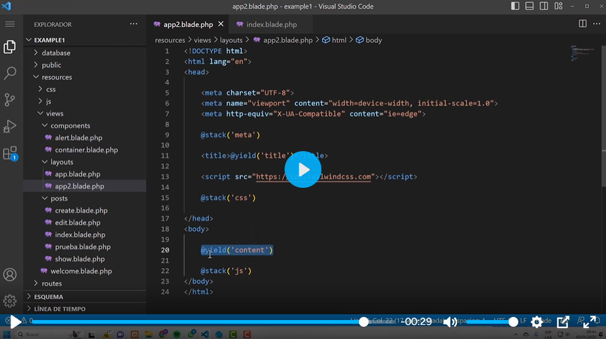
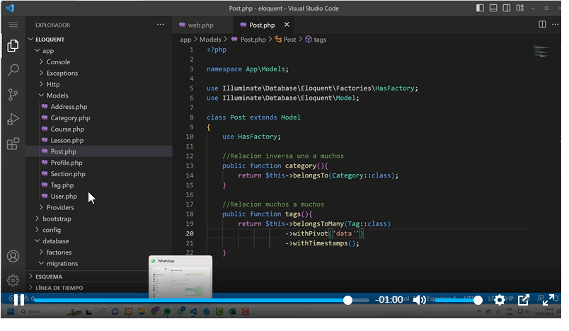
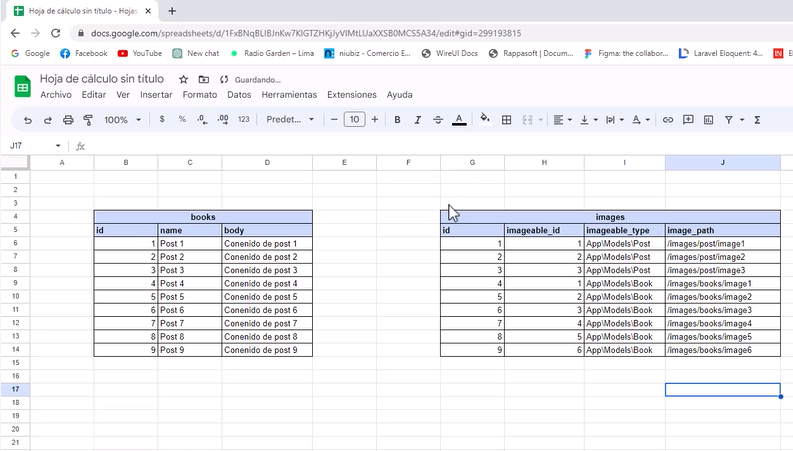
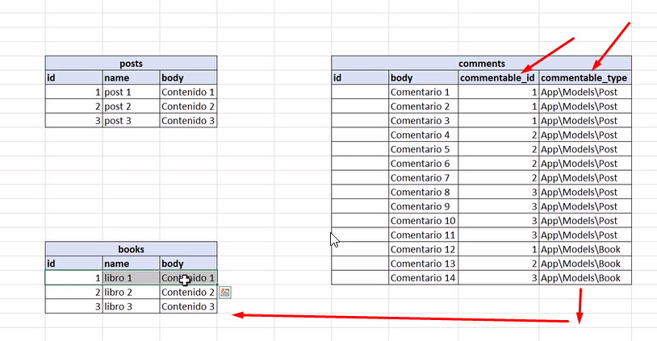
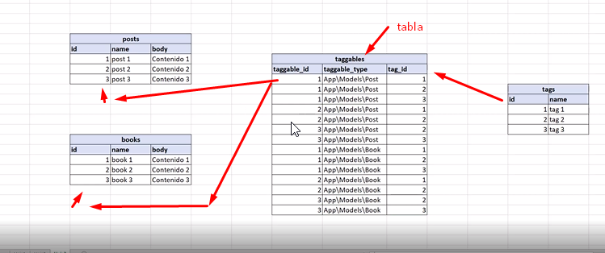
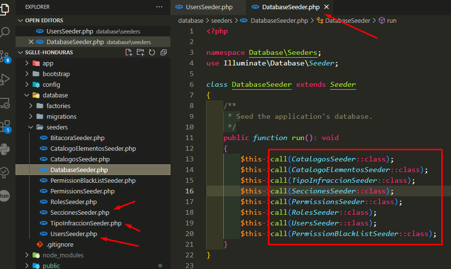
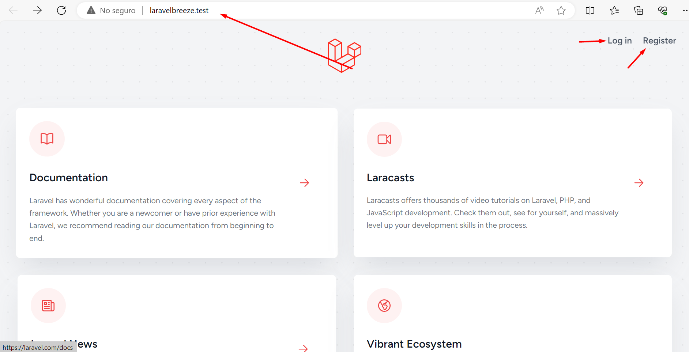
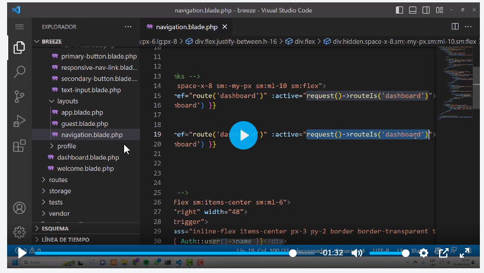

# Como parte de Mejoras y actualizaciones de PHP  iniciamos Laravel 10 


|Menu | 
|----------|
|Lista de Comandos Utiles |
| -- Comandos Artisan |
|Rutas  |
|Controladores  |
|Vistas  |
|Blade template  |
|Migraciones  |
|Querry Builder  |
|Introducción Eloquent  |
|Relaciones Eloquent   |
|Formularios  |
|Kit de inicio  |
|Solicitudes HTTP  |
|Validaciones  |

Mejor rendiemiento -> sysdm.cpl -> comando windows
--- 

## Lista de Comandos Utiles 

**Pasos para instalacción**
**Comando para Instalar Laravel 10**
- `composer global require laravel/installer` -> Con esto instalamos laravel de manera global 
- `laravel new LaravelBreeze` -> Podemos usar comando laravel para crear un proyecto
- `composer create-project laravel/laravel laravel-app "10.*"` -> Crear proyecto de manera manual y especificando version 
- `laravel -v` -> Laravel Installer 4.5.0
- `laravel new example-app`  -> forma mas rapida de instalar laravel 

**Comando resaltantes para Laravel 10**
- composer create-project laravel/laravel nombreProyecto "10.*"
- composer require laravel/breeze --dev `<opcional>`-> Ya viene con ciertos componentes para realizar el login  

**Sigue estos pasos en caso de atualizar composer**
- En windows Se debe instalr el `Composer-Setup.exe`
- Ejecutar los siguientes comandos
	- `composer clearcache`
	- `composer update`
	- `composer selfupdate`
	- `composer dump-autoload`
**Sigue estos pasos en caso de usar breeze**
- php artisan breeze:install -> 
**flujo normal**
- php artisan key:generate 
- php artisan migrate:refresh --seed
- php artisan migrate --seed
- npm install 
- npm run dev 


**Comandos Linux**
- whoami
- whoami /all /fo list 


## Comandos Artisan 

**Tips Listas Route**
- php artisan r:l -> Lista las router de manera mas corta 
- php artisan r:l --path=cursos -> Lista las q de manera mas corta 
- php artisan r:l --except-vendor -> me trae las rutas menos las que fueron instaladas por algun paquete 
- php artisan r:l --except-vendor -v -> me trae las rutas menos las que fueron instaladas por algun paquete y a parte me trae los nombre de los middleware 
- php artisan r:l --only-vendor -v -> me trae las rutas de paquetes
- php artisan route:clear	 -> limpiamos cache 
- php artisan route:cache -> Solo hacerlo en producción 


**Comandos de Make**
- `php artisan make:controller UserController` -> Crea un controlador 
- `php artisan make:controller PhotoController --resource` -> crea controlador y sus rutas en total son 7 metodos, [index, show, update, create, destroy, patch, put]
- `php artisan make:provider NombreEjemplo` -> Crear Provider 
- `php artisan make:factory NombreFactory --model=NombreModelo`

**Comandos View**
- php artisan view:clear
- php artisan optimize:clear
**Comandos Blade Paginacion**
- php artisan vendor:publish --tag=laravel-pagination

**Comandos Server** 
- php artisan serve --port=8002
- php artisan tinker


**Comandos Artisan BD:**
- php artisan db:seed --class=UsersTableSeeder 
- php artisan db:seed --class=UpdateCatalogoElementosSeeder
- php artisan migrate:refresh --seed 
- php artisan make:migration add_columna_to_casos_table
- php artisan make:migration create_casos_table
- php artisan migrate --path=database/migrations/2023_08_01_151922_add_column_to_denuncias_table.php
- php artisan make:seeder *Nombre*Seeder
- php artisan migrate:rollback
- php artisan migrate:reset


## Rutas 
**Concepto**
- Recuerda que laravel maneja las  rutas de manera eficiente en diferentes rutas y estas se encuentran  en el directorio 
- web.php -> controlas las rutas de tus paginas web
- api.php -> controla las rutas de tus Apis 

```
Route::get('/', function () {
    return view('welcome');
});
Route::get('/contacto', function () {
    return "hola desde la página de contacto";
});

//Nota cuida el orden y la jerarquia
Route::get('/cursos/informacion', function () {
    return "Aquí podras encontrar toda la información de los cursos";
});

//Como pasar Parametros
Route::get('/cursos/{curso}', function ($curso) {
    return "Bienvenido al".$curso;
});

// ? -> Esto esto permite que sea opcional
// whereAlpha -> Metodo que maneja la clase Route, permite validar las entradas solo deben ser whereAlpha
// whereAlphaNumeric ->
// Agregarlo de manera Global -> app/Providers/RouteServiceProvider.php  Anexar este valor lo convierte en generico `Route::pattern('id', '[0-9]+');`
Route::get('/cursos/{curso}/{category?}', function ($curso, $category = null) {
    if($category){
        return "Bienvenido al curso:$curso de la categoria:$category";
    }else{
        return "Bienvenido al curso:$curso";
    }
})->whereAlphaNumeric('curso');

```


# Controladores 

## 24. Qué es el modelo vista controlador (MVC)
**Concepto**
- El modelo representa los datos y la lógica de negocio de la aplicación, como la validación y la manipulación de datos. La vista es la representación visual de la información que se muestra al usuario, como las páginas HTML y las interfaces de usuario. El controlador actúa como intermediario entre el modelo y la vista, y maneja las solicitudes del usuario y la lógica de negocio correspondiente.
- En Laravel 10, el patrón MVC se implementa mediante la creación de modelos, vistas y controladores separados en su propio directorio dentro de la estructura de la aplicación. El modelo se define en una clase que representa una tabla de base de datos y se usa para realizar operaciones de base de datos como la creación, lectura, actualización y eliminación (CRUD) de datos. La vista se define en un archivo de plantilla que utiliza sintaxis de Laravel Blade para renderizar la interfaz de usuario. El controlador se define en una clase que maneja las solicitudes del usuario y se comunica con el modelo y la vista correspondientes.
- En general, el patrón MVC es una forma efectiva de estructurar una aplicación web y mantener la separación de responsabilidades. Laravel 10 hace que la implementación del patrón MVC sea sencilla y eficiente, lo que lo convierte en una buena opción para desarrollar aplicaciones web de manera rápida y efectiva.

## 25. Controladores

**Concepto**
- Al crear su aplicación en Laravel, puede generar fácilmente controladores con el comando make:controller. 
- Por defecto, los controladores se almacenan en el directorio app/Http/Controllers. 
- Por ejemplo, para crear un controlador UserController, puede ejecutar el siguiente comando:

**Pasos**
- Ejecutar este comando para crear controlador `php artisan make:controller UserController` 
- Un controlador puede contener cualquier número de métodos públicos que respondan a las solicitudes HTTP entrantes. 
- Por ejemplo, la siguiente clase UserController tiene un método show que muestra el perfil de usuario:
```
<?php

namespace App\Http\Controllers;

use App\Models\User;
use Illuminate\View\View;

class UserController extends Controller
{
   /**
    * Muestra el perfil de un usuario dado.
    */
   public function show(string $id): View
   {
       return view('user.profile', [
           'user' => User::findOrFail($id)
       ]);
   }
}
```
- Después de definir los métodos de su controlador, puede agregar una ruta que apunte a un método de controlador de la 
siguiente manera:

```
use App\Http\Controllers\UserController;

Route::get('/user/{id}', [UserController::class, 'show']);
```
- Cuando una solicitud HTTP entrante coincide con la URI de la ruta especificada, se invoca el método show de la clase UserController y los parámetros de ruta se pasan al método. 
- Para aprovechar al máximo sus controladores, asegúrese de seguir las convenciones de nomenclatura de Laravel y use los verbos HTTP adecuados para cada ruta.

## 26. Route Resource

**Concepto**
- En Laravel, el enrutamiento de recursos permite asignar las rutas típicas de creación, lectura, actualización y eliminación ("CRUD") a un controlador con una sola línea de código. Para ello, se puede utilizar el comando make:controller del Artisan junto con la opción --resource para crear rápidamente un controlador que maneje estas acciones.
- Por ejemplo, al ejecutar el siguiente comando se generará un controlador llamado PhotoController en app/Http/Controllers con métodos stub para cada una de las operaciones de recursos disponibles:

**Pasos**
- `php artisan make:controller PhotoController --resource`
- Luego, se puede registrar una ruta de recursos en el archivo routes/web.php que apunte al controlador recién creado de la siguiente manera:
```
use App\Http\Controllers\PhotoController;

Route::resource('photos', PhotoController::class);
```
- Con esta única declaración de ruta se crean múltiples rutas para manejar una variedad de acciones en el recurso. 
Además, se puede registrar muchos controladores de recursos a la vez pasando una matriz al método resources() de la siguiente manera:

```
Route::resources([
   'photos' => PhotoController::class,
   'posts' => PostController::class,
]);

//en caso que requiremos pocas rutas usando el metodo only 
Route::resources([
   'photos' => PhotoController::class,
   'posts' => PostController::class,
])->only(['index', 'show']);

Route::resources([
   'photos' => PhotoController::class,
   'posts' => PostController::class,
])->except(['index', 'show']);


```

- Por último, siempre es recomendable ejecutar el comando route:list del Artisan para obtener una descripción general rápida de las rutas de la aplicación.

## 27. Invoke

**Concepto**
- En algunas ocasiones, la lógica de una acción en particular puede ser lo suficientemente compleja como para justificar la creación de un controlador completo para esa acción en particular. 
- En estos casos, Laravel permite crear controladores de acción única.

**Pasos**
- Para crear un controlador de acción única en Laravel, se debe definir el método `__invoke` dentro del controlador. 
- Este método se ejecutará cuando se llame a la acción. 
- A continuación, se muestra un ejemplo de un controlador de acción única para provisionar un nuevo servidor web:
```
<?php

namespace App\Http\Controllers;

use App\Models\User;
use Illuminate\Http\Response;

class ProvisionServer extends Controller
{
   /**
    * Provision a new web server.
    */
   public function __invoke()
   {
       // ...
   }
}
```
- Para registrar una ruta para un controlador de acción única, se debe pasar el nombre del controlador al enrutador, sin especificar el nombre del método. 
- Por ejemplo:
```
use App\Http\Controllers\ProvisionServer;

Route::post('/server', ProvisionServer::class);
```
- También se puede generar un controlador de acción única usando el comando Artisan make:controller con la opción --invokable:
- `php artisan make:controller ProvisionServer --invokable`
- De esta manera, Laravel permite una mayor flexibilidad en la organización de los controladores y la lógica de las acciones en una aplicación web.

## 28. Grupo de rutas
**Concepto**
 - Los grupos de rutas en Laravel son una herramienta poderosa para compartir atributos de ruta, como el middleware, entre un conjunto de rutas, lo que evita tener que definir estos atributos en cada ruta individual. 
 - Además, los grupos anidados pueden fusionar de forma inteligente los atributos con su grupo principal, incluyendo middleware y condiciones "where", mientras que agregan nombres y prefijos automáticamente.
 
**Pasos**
- Por ejemplo, para asignar middleware a todas las rutas dentro de un grupo, simplemente usa el método middleware antes de definir el grupo. 
- El middleware se ejecuta en el orden en que aparecen en la matriz:
```
Route::middleware(['first', 'second'])->group(function () {
    Route::get('/', function () {
        // Usa los middlewares first y second...
    });
 
    Route::get('/user/profile', function () {
        // Usa los middlewares first y second...
    });
});

```
- También puedes definir un controlador común para todas las rutas dentro de un grupo usando el método controller:
```
use App\Http\Controllers\OrderController;

Route::controller(OrderController::class)->group(function () {
    Route::get('/orders/{id}', 'show');
    Route::post('/orders', 'store');
});
```
- Además, los grupos de rutas también se pueden usar para manejar el enrutamiento de subdominios. 
- A los subdominios se les pueden asignar parámetros de ruta, lo que le permite capturar una parte del subdominio para usar en su ruta o controlador. Para hacer esto, llama al método domain antes de definir el grupo:
```
Route::domain('{account}.example.com')->group(function () {
    Route::get('user/{id}', function (string $account, string $id) {
        // ...
    });
});
```
- El método prefix se puede usar para prefijar cada ruta en el grupo con un URI determinado, por ejemplo, puedes prefijar todos los URI de ruta dentro del grupo con "admin":
```
Route::prefix('admin')->group(function () {
    Route::get('/users', function () {
        // Coincide con la URL "/admin/users"
    });
});
```
- Finalmente, el método name se puede usar para prefijar cada nombre de ruta en el grupo con una cadena dada. 
- Esto es útil para, por ejemplo, anteponer los nombres de todas las rutas del grupo con "admin":
```
Route::name('admin.')->group(function () {
    Route::get('/users', function () {
        // Asigna el nombre de ruta "admin.users"...
    })->name('users');
});
```

# Vistas


## 29. Vistas ¿Qué son y cómo funcionan?


```
Además, exploraremos algunos de los conceptos clave detrás de las vistas en Laravel 10. Descubrirás cómo las vistas te permiten separar la lógica de presentación de la lógica de negocio de tu aplicación y cómo puedes utilizarlas para mejorar la legibilidad del código. También te mostraremos algunos ejemplos prácticos de cómo puedes utilizar las vistas en tus proyectos de Laravel.
```
**Tip**
- Directivas `@if(Route::has('login'))`
- Directivas `{{url('/home')}}`
- Directivas `{{route('/home')}}`
- @auth -> solo lo muestra con usuarios auteitcados 
- como llamarlas ` return view('nombreRuta name ')`

## 30. Pasar parámetros a vistas
> Dentro de laravel podemos enviar valores individuales o como arreglos podemos usar el metodo view para esto: 

**Recordar**
- compact es un método de php no de laravel 
- Recuerda que el compact no se necesita colocar elsimbolo ($) dolar de la variable 

```
public function show($post){

	return view('post.view', [
	'post'=>$post
	]);
	
}

// ó 
public function show($post){
	$hola='Hola mundo';
	return view('post.view', compact('post', 'hola'));
}

```

## 31. Pasar parámetros a todas las vistas

**Concepto**
- A veces, es necesario compartir datos con todas las vistas generadas por su aplicación. 
- Para hacer esto, puede utilizar el método share de la fachada View. 
- Por lo general, debe realizar llamadas al método share dentro del método boot de un proveedor de servicios. 
- Puede agregarlos a la clase App\Providers\AppServiceProvider o generar un proveedor de servicios separado para alojarlos.

**Paso**
- Aquí hay un ejemplo de cómo compartir datos en el proveedor de servicios AppServiceProvider:

```
namespace App\Providers;

use Illuminate\Support\Facades\View; // Paso 1
use Illuminate\Support\ServiceProvider;

class AppServiceProvider extends ServiceProvider
{
    /**
     * Register any application services.
     */
    public function register()
    {
        // ...
    }

    /**
     * Bootstrap any application services.
     */
    public function boot()
    {
        View::share('key', 'value'); //// Paso 2
    }
}
```

- Como usarla 
```
{{$key}}
```

**Resumen**
- En este ejemplo, la clave "key" se compartirá con todas las vistas generadas por su aplicación, y su valor será "value". 
- Puede acceder a estos datos en cualquier vista utilizando la sintaxis de la plantilla de Blade, como {{ $key }}.


## 32. Como crear y registrar un provider

**Concepto**
- Para escribir un proveedor de servicios en Laravel, debemos crear una nueva clase que implemente la Illuminate\Support\ServiceProvider interfaz. 
- Esta interfaz define dos métodos que debemos implementar: register() y boot().
- El método **register()** se usa para enlazar cosas en el contenedor de servicios de Laravel. 
- Por ejemplo, podemos enlazar una instancia de una clase en el contenedor, lo que nos permitirá acceder a esa instancia en cualquier lugar de nuestra aplicación.
- El método **boot()** se usa para realizar cualquier configuración que deba hacerse después de que se hayan registrado los enlaces del contenedor. 
- Esto podría incluir la definición de rutas, la publicación de activos o la configuración de middleware.
- Para registrar un proveedor de servicios con nuestra aplicación Laravel, debemos agregar la clase del proveedor a la providersmatriz en el config/app.phparchivo. 
- Luego, cada vez que nuestra aplicación se inicie, se llamará automáticamente al register() y boot() métodos en nuestra clase de proveedor.
- En resumen, los proveedores de servicios son una forma poderosa de extender y personalizar su aplicación Laravel. Al escribir sus propios proveedores de servicios, puede enlazar sus propias clases en el contenedor de servicios y realizar cualquier configuración necesaria para su aplicación.

**Comandos para crear**
- `php artisan make:provider NombreEjemplo->ViewServiceProvider`

## 33. View Composer

**Concepto**

- View Composer es una herramienta poderosa en Laravel 10 que permite definir la lógica de presentación en una ubicación centralizada y reutilizable. 
- En lugar de definir la lógica de presentación en cada controlador individualmente, View Composer te permite definirla una vez y utilizarla en múltiples vistas.
- Para utilizar View Composer en Laravel 10, primero debes crear una clase de View Composer que implemente el método 'composeIlluminate\View\View como su único argumento y te permite manipular la vista antes de que se muestre al usuario.
- Una vez que hayas creado la clase View Composer, debes registrarla en el método boot de un proveedor de servicios. 
- Dentro de este método, puedes utilizar el método 'composercomposer de la clase View para registrar la clase View Composer para una vista específica o para todas las vistas que utilizan un cierto layout.

**Pasos**
- Por ejemplo, si deseas definir la lógica de presentación para la vista de inicio de tu aplicación, puedes crear un View Composer llamado 'HomeComposer y registrarlo en un proveedor de servicios de la siguiente manera:

```
View::composer('home', HomeComposer::class);
```
- Esto definirá la lógica de presentación para la vista de inicio de tu aplicación en la clase HomeComposer.

**Resumen**
- En resumen, View Composer es una herramienta útil en Laravel 10 que permite definir la lógica de presentación en una ubicación centralizada y reutilizable. 
- Con la capacidad de definir la lógica de presentación una vez y utilizarla en múltiples vistas, View Composer puede mejorar la estructura y la organización del código. 
- Al crear una clase View Composer y registrarla en un proveedor de servicios, se puede definir la lógica de presentación para una vista específica o para todas las vistas que utilizan un cierto layout.


**Recomendaciones**
- Paso 1 desde la app genera un nuevo directorio llamandolo `View`
- Paso 2 Genera otro directorio llamado `Composers`
- Paso 3: Generamos una clase llamada PostComposer.php -> Post es el nombre que manejara tu vista en este caso es un CRUD para un  Post 

```

 <?php
 
 namespace App\View\Composers //-> Este es tu ame de tu directorio 
 use Illuminate\View\View; 
 
 class PostComposer{
 
	public function compose(View $view){
		$view->with('variable', 'Esto es una prueba de variable');
	}
	
 }
```
- Paso 4: conque vistas quremos compartir esta variable debemos vincularlo con un provider podemos crearlo o anexarlo a los que existen 
- Paso 5: ubicamos el provider para este ejemplo usamos `AppServiceProvider` y en el metodo boot anexamos lo siguiente 
```
<?php

namespace App\Providers;

use Illuminate\Support\ServiceProvider;
use Illuminate\Pagination\Paginator;

class AppServiceProvider extends ServiceProvider
{
    /**
     * Register any application services.
     */
    public function register(): void
    {
        //
    }

    /**
     * Bootstrap any application services.
     */
    public function boot(): void
    {
        /**
         * Description: me permite usar el paginador de boostrap 5, ya que por defecto usa los css de tailwindcss
         *
         */
        Paginator::useBootstrapFive();
		
		view::composer([
			'post.create', //Nombre de tus vistas creadas en el web.php 
			'post.edit', //Nombre de tus vistas creadas en el web.php 
			'post.show', //Nombre de tus vistas creadas en el web.php 
		], PostComposer::class);
		
		//ó para hacerlo de manera general  el (*) le identificamos que desde post cualquier elemento puede acceder a esta variable 
		view::composer('post.*', PostComposer::class);
		
		
    }
}

```
- Paso 6: ya solo queda imprimirlo en tu view de resourse de la manera simple ejemplo: 

```
echo  $variable; 

{{$variable}}

```


# Blade template 

## 34. Visualización de datos

**Concepto**
- En Laravel, es posible mostrar los datos que se pasan a las vistas de Blade mediante el uso de llaves dobles. 
- Por ejemplo, si se tiene la siguiente ruta y se desea mostrar el contenido de la variable 'name' en la vista 'welcome':

**Pasos**
```
Route::get('/', function () {
    return view('welcome', ['name' => 'Samantha']);
});

```
- Se puede mostrar el contenido de la variable 'name' en la vista usando la sintaxis de llaves dobles de Blade:

```
Hello, {{ $name }}.
```

- Sin embargo, Blade no está limitado a mostrar solo variables. 
- También se puede utilizar para mostrar los resultados de cualquier función de PHP. 
- Por ejemplo, para mostrar la marca de tiempo UNIX actual en la vista, se puede utilizar el siguiente código:
```
The current UNIX timestamp is {{ time() }}.
```

- De esta manera, se puede utilizar Blade para mostrar cualquier tipo de contenido en las vistas de Laravel.
- Por defecto, las declaraciones de Blade se envían automáticamente a través de la función PHP htmlspecialchars para evitar ataques XSS al mostrar contenido en las vistas de Laravel. 
- Sin embargo, si por alguna razón desea imprimir contenido sin escapar, Blade también proporciona una sintaxis especial para eso.

**Resumen**
- En lugar de usar llaves dobles, puede utilizar llaves de exclamación para que Blade no escape el contenido. 
- Por ejemplo, para imprimir el contenido de la variable 'name' sin escapar, se puede utilizar la siguiente sintaxis:
```
Hello, {!! $name !!}.
```

- Sin embargo, se recomienda usar la sintaxis de llaves dobles predeterminada de Blade para garantizar la seguridad de su aplicación. 
- Solo use la sintaxis de llaves de exclamación si tiene una buena razón para hacerlo y comprende los posibles riesgos de seguridad.


## 35. Marco Blade y Javascript

**Concepto**
- Cuando se trabaja con marcos de JavaScript junto con Blade, puede haber un conflicto en el uso de llaves rizadas para indicar una expresión que debe ser mostrada en el navegador. 
- Para resolver esto, Blade proporciona la sintaxis del símbolo @ para informar al motor de renderizado que una expresión debe permanecer intacta.

**Pasos
- Por ejemplo, si se tiene la siguiente vista de Blade que usa llaves rizadas tanto para Blade como para el marco de JavaScript:

<h1>Laravel</h1>
Hello, {{ name }}.

- El motor de Blade procesará la expresión {{ name }}, lo que puede interferir con el marco de JavaScript. 
- Para evitar esto, se puede usar la sintaxis del símbolo @ para escapar la expresión de Blade:

<h1>Laravel</h1>
Hello, @{{ name }}.

- En este caso, Blade eliminará el símbolo @, pero la expresión {{ name }} permanecerá intacta, lo que permitirá que el marco de JavaScript la procese.
- Además, también se puede utilizar el símbolo @ para escapar de las directivas de Blade, como en el siguiente ejemplo:


{{-- Blade template --}}
@@if()
 
<!-- HTML output -->
@if()
De esta manera, se puede evitar que Blade procese una directiva y se puede imprimir la directiva sin procesar en la salida HTML.

@if( !in_array($asociacion->tipoSerie?->code, ['tipo_serie_componente', 'tipo_serie_federacion', 'tipo_serie_confederacion']) ) required @endif


if (!\Request::is('revision/acuse-analisis-formal/*') && !\Request::is('tramites/solicitud-tramite/*') && !\Request::is('firma/*')) {
	$html.='<p class="border-top mt-1 pt-1">'.$documento->descripcion.' </p><p><a data-componente="documento" data-documento="'.$documento->id.'" href="" class="opcion-resumen link-pdf link-stps font-weight-bold mt-2 mb-2">Ver documento</a>'.$documento->fecha_carga.'</p>';
}

## 36. Directiva @json

> La directiva @json permite que los datos se muestren como formato JSON en la página web.

**Notas**
- @Json viene de la paleta -> Illuminate\Support\Js::from.
- 


//Por ejemplo, en lugar de llamar a json_encode manualmente como en este ejemplo:

<script>
    var app = <?php echo json_encode($array); ?>;
</script>
//Se puede usar la directiva Illuminate\Support\Js::from de la siguiente manera:

<script>
    var app = {{ Illuminate\Support\Js::from($array) }};
</script>


//Además, en las últimas versiones del esqueleto de la aplicación Laravel, se incluye una fachada Js que proporciona un acceso más conveniente a esta funcionalidad dentro de las plantillas Blade:

<script>
    var app = {{ Js::from($array) }};
</script>

Además, en las últimas versiones del esqueleto de la aplicación Laravel, se incluye una fachada Js que proporciona un acceso más conveniente a esta funcionalidad dentro de las plantillas Blade:

<script>
    let app = @json($post);
	console.log(app);
</script>


## 37. Directivas condicionales

>  Aprenderás sobre las diferentes directivas disponibles, que son @if, @unless, @isset y @empty


//En Blade, puedes construir sentencias condicionales utilizando las directivas @if, @elseif, @else y @endif, que funcionan de manera similar a sus contrapartes en PHP. Por ejemplo:

@if (count($records) === 1)
	Tengo un registro.
@elseif (count($records) > 1)
	Tengo varios registros.
@else
	No tengo registros.
@endif

//Además, Blade proporciona una directiva @unless para mayor comodidad:

@unless (Auth::check()) //Espera que la directiva pase un false para poder entrar 
	No has iniciado sesión.
@endunless

@isset($records)
// $records está definido y no es nulo...
@endisset

@empty($records)
// $records está "vacío"...
@endempty
```

## 38. Directivas Environments

> En Blade, puedes verificar si la aplicación se está ejecutando en el entorno de producción utilizando la directiva @production:
**Nota**
- Tu archivo .env debe existir el valor en este caso -> APP_ENV=local cuando se pasa a produccion es APP_ENV=production

```
@env('local')
// La aplicación se está ejecutando en "staging"...
@endenv

@env(['local', 'production'])
// La aplicación se está ejecutando en "staging" o "production"...
@endenv
```

## 39. Directivas switch

```
//En Blade, puedes construir declaraciones switch utilizando las directivas @switch, @case, @break y @default:

@switch($i)
    @case(1)
        Primer caso...
        @break
 
    @case(2)
        Segundo caso...
        @break
 
    @default
        Caso predeterminado...
@endswitch
```


## 40. 41. 42  Directiva @foreach @forelse @while


```
 //Blade proporciona directivas simples para trabajar con las estructuras de bucle de PHP. Cada una de estas directivas funciona de manera idéntica a sus contrapartes de PHP:

@for ($i = 0; $i < 10; $i++)
    El valor actual es {{ $i }}
@endfor
 
@foreach ($users as $user)
    <p>Este es el usuario {{ $user->id }}</p>
@endforeach
 
@forelse ($users as $user)
    <li>{{ $user->name }}</li>
@empty
    <p>No hay usuarios</p>
@endforelse
 
@while (true)
    <p>Estoy en un bucle infinito.</p>
@endwhile
```

## 43. Directiva @Continue y @break

> Al usar bucles, también puede omitir la iteración actual o finalizar el bucle usando las directivas @continue y @break:
```

@foreach ($users as $user)
    @if ($user->type == 1)
        @continue
    @endif
 
    <li>{{ $user->name }}</li>
 
    @if ($user->number == 5)
        @break
    @endif
@endforeach

// También puede incluir la condición de continuación o interrupción dentro de la declaración de la directiva:

@foreach ($users as $user)
    @continue($user->type == 1)
 
    <li>{{ $user->name }}</li>
 
    @break($user->number == 5)
@endforeach

```


## 44. Directiva Variable @Loop

> Al utilizar un bucle foreach en Laravel, se crea automáticamente una variable de bucle llamada $loop que proporciona información valiosa sobre la iteración actual. 

```
@foreach ($users as $user)
   
	indice        - {{$loop->index}}
	Interaccion   - {{$loop->interation}}
	Cuanto falta  - {{$loop->remaining }}
	Cantidad  - {{$loop->count }}
	Cuanto falta  - {{$loop->even }} true si es par
	Cuanto falta  - {{$loop->odd }} true si es impar 
	Cuanto Profundidad - {{$loop->depth }} devuelve nivel  
   @if ($loop->first)
        This is the first iteration.
    @endif
 
    @if ($loop->last)
        This is the last iteration.
    @endif
 
    <p>This is user {{ $user->id }}</p>
@endforeach

// Si se está en un bucle anidado, se puede acceder a la variable $loop del bucle principal a través de la propiedad "parent". En el siguiente ejemplo, se utiliza un bucle anidado para iterar sobre los posts de cada usuario.

@foreach ($users as $user)
    @foreach ($user->posts as $post)
        @if ($loop->parent->first)
            This is the first iteration of the parent loop.
        @endif
    @endforeach
@endforeach


```

## 45. Directiva @Class

> La directiva @class permite compilar condicionalmente una cadena de clase CSS. 
- Se le puede pasar una matriz de clases donde la clave de la matriz contiene la clase o clases que deseas agregar, mientras que el valor es una expresión booleana. 
- Si el elemento de la matriz tiene una clave numérica, siempre se incluirá en la lista de clases representadas: 

**Ejemplo**
```

@php
    $isActive = false;
    $hasError = true;
@endphp
 
<span @class([
    'p-4',
    'font-bold' => $isActive,
    'text-gray-500' => ! $isActive,
    'bg-red' => $hasError,
])></span>
 
<span class="p-4 text-gray-500 bg-red"></span>


@php
    $isActive = true;
@endphp
 
<span @style([
    'background-color: red',
    'font-weight: bold' => $isActive,
])></span>
 
<span style="background-color: red; font-weight: bold;"></span>

// La mas usada 
//Podemos definir nuestras hoja de estilo previamnete y llamar por cada clase para este ejemplo crearemos el style en la misma pagina

<style>
	.color-red{
		color:red;
	}
	.color-verde{
		color:green;
	}

</style>


<ul>
	@foreach($lista as $fila)
	<li @class([
		'color-red'=>$loop->first,  //siempre si es true coloca el estilo para este caso usamos la directiva $loop
		'color-verde'=>$loop->last,  //siempre si es true coloca el estilo para este caso usamos la directiva $loop
		])>
		
		<h1>{{$fila['name']}}</h1>	
	</li>
	@endforeach
</ul>


```

## 46. Atributos adicionales


> Puedes utilizar la directiva @checked para indicar si una casilla de verificación HTML está marcada, proporcionando una forma fácil de hacerlo. Esta directiva se repetirá si la condición proporcionada se evalúa como verdadera:
//Todo esto viene de laravel 9
```
<input type="checkbox"
        name="active"
        value="active"
        @checked(old('active', $user->active)) />
		
		
		
<select name="version">
    @foreach ($product->versions as $version)
        <option value="{{ $version }}" @selected(old('version') == $version)>
            {{ $version }}
        </option>
    @endforeach
</select>


<button type="submit" @disabled($errors->isNotEmpty())>Submit</button>

<input type="email"
        name="email"
        value="email@laravel.com"
        @readonly($user->isNotAdmin()) />
		
		
<input type="text"
        name="title"
        value="title"
        @required($user->isAdmin()) />
		
```

## 47. Directiva include


```
La directiva @include de Blade en Laravel te permite incluir una vista de Blade dentro de otra vista. 
Al incluir una vista, todas las variables disponibles en la vista principal estarán disponibles en la vista incluida. 
Además, puedes pasar datos adicionales que deberían estar disponibles en la vista incluida.

Por ejemplo,  
- @includeIf('nombreVista', ['color'=>'red'])-> para incluir una vista que no siempre está presente, utiliza la directiva
- @includeWhen(true, 'nombreVista',['color'=>'red']) y @includeUnless. ->  Si quieres evaluar una expresión booleana y luego incluir una vista basada en el resultado, utiliza las directivas  
- @includeFirst(['vista1','vista2','vista3'],['color'=>'red']) ->  Por último, si deseas incluir la primera vista que existe de una matriz dada de vistas, utiliza la directiva .
```


## 48. Componentes de clase

> jeje A fuerza y a ensayo aprendimos usar esto hay que memorizar comandos es facil de usar y de crear y mantener 

Paso 1: Crear 
**Comandos**
- php artisan make:component nombre 
- php artisan make:component Alert 

Paso 2: llamar 
<x-alert>
	Hola mundo 
</x-alert>

Paso 3: pasar parametros  
- Slot principal -> 
```
<x-alert>
	Hola mundo 
</x-alert>

{{$slot}}
```


- Slot Alternos -> 

<x-alert>
	<x-slot name='title'>
		Error
	</x-slot>
	Hola mundo 
</x-alert>


> En este ejemplo, la variable '$tasks se pasa al componente de clase como un parámetro a través del atributo 
'tasks. 
- El componente de clase procesa los datos y muestra la lista de tareas utilizando la vista Blade 'task-list.blade.phptask-list.blade.php.

```
<x-task-list :tasks="$tasks" />

``` 
 
 
**Nota**  
- usamos slot para variables o texto largos 
- Si son cortos podemos usar enviar parametrosc por atributos estos se definen en el controlador del componente usando los "type" 
- Si usamos los dos puntos le decimos a laravel que es un codigo php ":" Ejemplo -> `:tasks="$tasks"` ó podemos usarlo así `tasks={{$tasks}}` 
- Recuerda cualquier cosa que coloquemos en el componente `<x-alert>` 
bien sea una class para estilo o algo mas eso lo esta recibiendo la clase y en el contruct de la clase del controlador
pero podemos usar el comodin {{attributes}} este comodin nos permite <x-alert class="mb-3" info="123123" nombre="leo">
desde la view del componente sin necesidad de definir en el contucttor dichas variables  


## 49. Componentes anónimos

> En este capítulo, aprenderás cómo utilizar los componentes anónimos en Laravel 10. 
- Los componentes anónimos son una forma de definir componentes Blade en línea, lo que facilita la creación de componentes simples y reutilizables.


- Creamos 
```
container.blade.php 
<div class="max-w-7xl mx-auto px-4 sm:px-6 lg:px-8">
	{{$slot}}
</div>
```

- Implementamos
```
<x-container>
	
	aqui tu codigo html cualquiera 
	o incluso mas componentes 
	
	<x-alert :class={{$class}}/>

</x-container>
```

> Nota
- Para centrar usando tailwindcss -> <div class="max-w-7xl mx-auto px-4 sm:px-6 lg:px-8">
- podemos usar los compoenente anónimos en este caso no es necesario generar el artisan y que este tenga su clase 
controlador podemos ir a resouser y crearlos como un archivo blade siempre y cuando este en su directorio `components` ejemplo 
- Tambien podemos usar la directiva `@props` para enviar paramentros sin necesidad de usar la clase controlador ejemplo 


- Creamos 
```
container.blade.php 

@props(['width'=>'max-w-7xl']) // definir por defecto en caso que no se envie el valor 

<div {{attributes->merge(['class' => "$width mx-auto px-4 sm:px-6 lg:px-8" ]) }}>
	{{$slot}}
</div>
```
- Implementamos 
```
<x-container width='max-w-6xl'>
	
	aqui tu codigo html cualquiera 
	o incluso mas componentes 
	
	<x-alert :class={{$class}}/>

</x-container>

```

## 50. Componentes como plantilla
> Los componentes como plantilla son una forma de crear plantillas de vista reutilizables que pueden ser utilizadas en toda tu aplicación.

**Nota** 
- Pues de esta clase nos quedamos algo tranquilos ya que explica como crear plantillas esto ya depende de tu modelo de negocio y diseño 
- para esto pues nos apalancamos con las clases de platzi para mejorar el front
- El realiza un componente para el layout, luego header, luego footer y así va hasta tener varias plantillas 

**Enlace** 
- Dejo enlace de la clase para echar un vistazo rapido [Clase 50](https://codersfree.com/courses-status/aprende-laravel-avanzado/componentes-como-plantilla)


## 51. Herencia de plantillas Blade
>  La herencia de plantillas Blade te permite crear plantillas de vista base que pueden ser heredadas y extendidas por otras vistas en tu aplicación.

**Nota** 
- Pues de esta clase nos quedamos algo tranquilos ya que explica como crear plantillas esto ya depende de tu modelo de negocio y diseño 
- para esto pues nos apalancamos con las clases de platzi para mejorar el front
- El realiza un componente para el layout, luego header, luego footer y así va hasta tener varias plantillas 
- aqui usamos la directica @yield('title') y @yield('content') para plantillas dinamicas 
- Laravel <7 se usan las plantillas @extends('ruta') y @section('nombreSection') 
- Laravel >7 se usan componenentes es la forma que trabajan jeattream 
**Enlace** 
- Dejo enlace de la clase para echar un vistazo rapido [Clase 50](https://codersfree.com/courses-status/aprende-laravel-avanzado/sistema-de-plantilla)

## 52. Directiva @stack

> Nos permite apilar diferente contenidos 
- Incluir datos de manera dinamica 
- 
```
-  crear 
@push('meta')
	<meta name="description" content="Ejemplo"/>
@endpush 

@push('meta')
	<meta name="keywords" content="soy otro Ejemplo"/>
@endpush 
```

- Inplementar 
```
 @stack('meta')


**Nota** 
- @stack es casi igual que @yield solo que stack podremos usar el push sin necesidad de declarar una section  
- tambien nos permite apilar pequeños fragmentos diferennte el apila 


**Ejemplo** 



## Migraciones


## 53. Conexión a base de datos

- Esta ya la conocemos no somos expertos pero sabemos lo básico 
- Archivos: 
	- config 
		- database.php 
	- .env -> aqui debemos configurar las conexiones a base de datos 
```
Para conectar tu aplicación Laravel 10 a una base de datos, primero debes configurar la conexión en el archivo .env de tu aplicación. Abre el archivo .env y busca las variables de entorno que comienzan con "DB_". Asegúrate de que estas variables se ajusten a la configuración de tu base de datos:

DB_CONNECTION=mysql
DB_HOST=127.0.0.1
DB_PORT=3306
DB_DATABASE=nombre_de_la_base_de_datos
DB_USERNAME=nombre_de_usuario
DB_PASSWORD=contraseña
```


## 54. Introducción a migraciones

**Enlaces**

- Comandos y premisas para las migraciones 
	- https://styde.net/laravel-6-doc-base-de-datos-migraciones/ 


Creando columnas
El método table en la clase facade Schema puede ser usado para actualizar tablas existentes. Igual que el método create acepta dos argumentos: el nombre de la tabla y una Closure que recibe una instancia de la clase Blueprint que puedes usar para agregar columnas a la tabla:
```
Schema::table('users', function (Blueprint $table) {
    $table->string('email');
});
```
**Tipos de columna permitidos**
El constructor de esquema contiene una variedad de tipos de columna que puedes especificar al momento de construir tus tablas:

Comando	Descripción
```
$table->bigIncrements('id');	Tipo de columna equivalente a auto-incremento UNSIGNED BIGINT (clave primaria).
$table->bigInteger('votes');	Tipo de columna equivalente a BIGINT.
$table->binary('data');	Tipo de columna equivalente a BLOB.
$table->boolean('confirmed');	Tipo de columna equivalente a BOOLEAN.
$table->char('name', 100);	Tipo de columna equivalente a CHAR con una longitud.
$table->date('created_at');	Tipo de columna equivalente a DATE.
$table->dateTime('created_at', 0);	Tipo de columna equivalente a DATETIME con precisión (dígitos totales).
$table->dateTimeTz('created_at', 0);	Tipo de columna equivalente a DATETIME (con zona horaria) con precisión (dígitos totales).
$table->decimal('amount', 8, 2);	Tipo de columna equivalente a DECIMAL con una precisión (el total de dígitos) y escala de dígitos decimales.
$table->double('amount', 8, 2);	Tipo de columna equivalente a DOUBLE con una precisión (el total de dígitos) y escala de dígitos decimales.
$table->enum('level', ['easy', 'hard']);	Tipo de columna equivalente a ENUM.
$table->float('amount', 8, 2);	Tipo de columna equivalente a FLOAT con una precisión (el total de dígitos) y escala de dígitos decimales.
$table->geometry('positions');	Tipo de columna equivalente a GEOMETRY.
$table->geometryCollection('positions');	Tipo de columna equivalente a GEOMETRYCOLLECTION.
$table->increments('id');	Tipo de columna equivalente a auto-incremento UNSIGNED INTEGER (clave primaria).
$table->integer('votes');	Tipo de columna equivalente a INTEGER.
$table->ipAddress('visitor');	Tipo de columna equivalente a dirección IP.
$table->json('options');	Tipo de columna equivalente a JSON.
$table->jsonb('options');	Tipo de columna equivalente a JSONB.
$table->lineString('positions');	Tipo de columna equivalente a LINESTRING.
$table->longText('description');	Tipo de columna equivalente a LONGTEXT.
$table->macAddress('device');	Tipo de columna equivalente a dirección MAC.
$table->mediumIncrements('id');	Tipo de columna equivalente a auto-incremento UNSIGNED MEDIUMINT (clave primaria).
$table->mediumInteger('votes');	Tipo de columna equivalente a MEDIUMINT.
$table->mediumText('description');	Tipo de columna equivalente a MEDIUMTEXT.
$table->morphs('taggable');	Agrega los tipos de columna equivalente a UNSIGNED BIGINT taggable_id y VARCHAR taggable_type.
$table->uuidMorphs('taggable');	Agrega las columnas UUID equivalentes taggable_id CHAR(36) y taggable_type VARCHAR(255).
$table->multiLineString('positions');	Tipo de columna equivalente a MULTILINESTRING.
$table->multiPoint('positions');	Tipo de columna equivalente a MULTIPOINT.
$table->multiPolygon('positions');	Tipo de columna equivalente a MULTIPOLYGON.
$table->nullableMorphs('taggable');	Agrega versiones nullable de las columnas morphs().
$table->nullableUuidMorphs('taggable');	Agrega versiones nullable de las columnas uuidMorphs().
$table->nullableTimestamps(0);	Alias del método timestamps().
$table->point('position');	Tipo de columna equivalente a POINT.
$table->polygon('positions');	Tipo de columna equivalente a POLYGON.
$table->rememberToken();	Agrega un tipo de columna equivalente a VARCHAR(100) que permita nulos para remember_token.
$table->set('flavors', ['strawberry', 'vanilla']);	Tipo de columna equivalente a SET.
$table->smallIncrements('id');	Tipo de columna equivalente a auto-incremento UNSIGNED SMALLINT (clave primaria).
$table->smallInteger('votes');	Tipo de columna equivalente a SMALLINT.
$table->softDeletes(0);	Agrega un tipo de columna equivalente a TIMESTAMP que permita nulos para deleted_at en eliminaciones lógicas con precisión (dígitos totales).
$table->softDeletesTz(0);	Agrega un tipo de columna equivalente a TIMESTAMP que permita nulos para deleted_at (con la zona horaria) en eliminaciones lógicas con precisión (dígitos totales).
$table->string('name', 100);	Tipo de columna equivalente a VARCHAR con una longitud.
$table->text('description');	Tipo de columna equivalente a TEXT.
$table->time('sunrise', 0);	Tipo de columna equivalente a TIME con precisión (dígitos totales).
$table->timeTz('sunrise', 0);	Tipo de columna equivalente a TIME (con la zona horaria) con precisión (dígitos totales).
$table->timestamp('added_on', 0);	Tipo de columna equivalente a TIMESTAMP con precisión (dígitos totales).
$table->timestampTz('added_on', 0);	Tipo de columna equivalente a TIMESTAMP (con la zona horaria) con precisión (dígitos totales).
$table->timestamps(0);	Agrega los tipos de columnas equivalentes a TIMESTAMP que permitan nulos para created_at y updated_at con precisión (dígitos totales).
$table->timestampsTz(0);	Agrega los tipos de columnas equivalentes a TIMESTAMP (con la zona horaria) que permitan nulos para created_at y updated_at con precisión (dígitos totales).
$table->tinyIncrements('id');	Tipo de columna equivalente a auto-incremento UNSIGNED TINYINT (clave primaria).
$table->tinyInteger('votes');	Tipo de columna equivalente a TINYINT.
$table->unsignedBigInteger('votes');	Tipo de columna equivalente a UNSIGNED BIGINT.
$table->unsignedDecimal('amount', 8, 2);	Tipo de columna equivalente a UNSIGNED DECIMAL con una precisión (total de dígitos) escala (dígitos decimales).
$table->unsignedInteger('votes');	Tipo de columna equivalente a UNSIGNED INTEGER.
$table->unsignedMediumInteger('votes');	Tipo de columna equivalente a UNSIGNED MEDIUMINT.
$table->unsignedSmallInteger('votes');	Tipo de columna equivalente a UNSIGNED SMALLINT.
$table->unsignedTinyInteger('votes');	Tipo de columna equivalente a UNSIGNED TINYINT.
$table->uuid('id');	Tipo de columna equivalente a UUID.
$table->year('birth_year');	Tipo de columna equivalente a YEAR.
```


**Modificadores de columna**
Además de los tipos de columna listados anteriormente, hay varios «modificadores» de columna que puedes usar al momento de agregar una columna a la tabla de base de datos. Por ejemplo, para hacer que la columna «acepte valores nulos», puedes usar el método nullable.
```
Schema::table('users', function (Blueprint $table) {
    $table->string('email')->nullable();
});
```
La siguiente lista contiene todos los modificadores de columna disponibles. Esta lista no incluye los modificadores de índice:

Modificador	Descripción
```
->after('column')	Coloca la columna «después de» otra columna (MySQL)
->autoIncrement()	Establece las columnas tipo INTEGER como auto-incremento (clave primaria)
->charset('utf8')	Especifica un conjunto de caracteres para la columna (MySQL)
->collation('utf8_unicode_ci')	Especifica un ordenamiento para la columna (MySQL/PostgreSQL/SQL Server)
->comment('my comment')	Agrega un comentario a una columna (MySQL/PostgreSQL)
->default($value)	Especifica un valor «predeterminado» para la columna
->first()	Coloca la columna al «principio» en la tabla (MySQL)
->nullable($value = true)	Permite que valores NULL (por defecto) sean insertados dentro de la columna
->storedAs($expression)	Crea una columna generada almacenada (MySQL)
->unsigned()	Establece las columnas tipo INTEGER como UNSIGNED (MySQL)
->useCurrent()	Establece las columnas tipo TIMESTAMP para usar CURRENT_TIMESTAMP como valor predeterminado
->virtualAs($expression)	Crea una columna generada virtual (MySQL)
->generatedAs($expression)	Crea una columna de identidad con opciones de secuencia especificadas (PostgreSQL)
->always()	Define la precedencia de los valores de secuencia sobre la entrada para una columna de identidad (PostgreSQL)
```

## 55. Crear tablas con migraciones

> Las migraciones son una herramienta de Laravel que te permiten crear, modificar y eliminar tablas en tu base de datos de forma programática y versionada. Esto significa que puedes definir los cambios en la estructura de la base de datos en código y controlar su evolución a través del control de versiones de tu aplicación.

- Para crear una migración en Laravel, puedes usar el comando 'make:migrationdatabase/migrations. 
- Por ejemplo, para crear una migración llamada 'create_users_tablecreate_users_table, puedes ejecutar el siguiente comando en tu terminal:
- php artisan make:migration create_users_table
- este comando generará un archivo de migración con un nombre similar a '2023_03_21_000000_create_users_table.php
- Una vez que hayas generado la migración, puedes abrir el archivo en tu editor de código y definir la estructura de la tabla que deseas crear. Por ejemplo, para crear una tabla de usuarios con campos de nombre, correo electrónico y contraseña, puedes usar el siguiente código:

```
use Illuminate\Database\Migrations\Migration;
use Illuminate\Database\Schema\Blueprint;
use Illuminate\Support\Facades\Schema;
class CreateUsersTable extends Migration
{
   public function up()
   {
       Schema::create('users', function (Blueprint $table) {
           $table->bigIncrements('id'); 
           $table->string('name');
           $table->string('email')->unique();
           $table->string('password');
           $table->timestamps();
       });
   }
   public function down()
   {
       Schema::dropIfExists('users');
   }
}
```

## 56. Revertir cambios 


> Usando migrate podemos generar puntos de roolback para realizar esta  reversión podemos ejecutar el comando
- `php artisan migrate:rollback`


## 57. Actualizar tabla con migraciones


> Para revertir una migración específica, puedes utilizar el comando "rollback" de Artisan. 
- Por ejemplo, si tienes una migración llamada "create_users_table" y deseas revertirla, puedes ejecutar el siguiente comando en la terminal:
- php artisan migrate:rollback --step=1
- El parámetro "--step=1" indica que solo se debe revertir la última migración. 
- Si deseas revertir varias migraciones, puedes aumentar el valor de "--step" según el número de migraciones que deseas revertir.
- También puedes utilizar el comando "rollback" sin el parámetro "--step" para revertir todas las migraciones que se hayan aplicado. 
- Por ejemplo: php artisan migrate:rollback
- Si deseas eliminar completamente todas las tablas de la base de datos y revertir todas las migraciones, puedes utilizar el comando "reset". 
- Este comando elimina todas las tablas de la base de datos y luego ejecuta todas las migraciones de nuevo. 
- Para utilizar el comando "reset", puedes ejecutar el siguiente comando en la terminal:
- php artisan migrate:reset
- Ten en cuenta que el comando "reset" eliminará todos los datos de la base de datos, por lo que debes tener cuidado al utilizarlo en entornos de producción.


**Nota**
- PostgreSQL por el momento (v14.9) no soporta la alteración de posición de columnas.
- ¿Qué quiere decir ésto? Pues que no será posible hacer uso de la función after() mostrada en la unidad.


## 58. Eliminar tablas

Se trata de renombrar nuestra tabla posts por el nombre articles, siguiendo estos pasos:

Creamos una nueva migración con artisan make:migration rename_posts_table
2. En el cuerpo de la función up() incluímos:

Schema::rename('posts', 'articles');
3. En el cuerpo de la función down() incluímos:

Schema::rename('articles', 'posts');
Schema::dropIfExists('articles', 'posts');
Son la misma función, pero invirtiendo los nombres.


## 59. Tipos de datos

**Tipos de columna permitidos**
El constructor de esquema contiene una variedad de tipos de columna que puedes especificar al momento de construir tus tablas:

Comando	Descripción
```
$table->bigIncrements('id');	Tipo de columna equivalente a auto-incremento UNSIGNED BIGINT (clave primaria).
$table->bigInteger('votes');	Tipo de columna equivalente a BIGINT.
$table->binary('data');	Tipo de columna equivalente a BLOB.
$table->boolean('confirmed');	Tipo de columna equivalente a BOOLEAN.
$table->char('name', 100);	Tipo de columna equivalente a CHAR con una longitud.
$table->date('created_at');	Tipo de columna equivalente a DATE.
$table->dateTime('created_at', 0);	Tipo de columna equivalente a DATETIME con precisión (dígitos totales).
$table->dateTimeTz('created_at', 0);	Tipo de columna equivalente a DATETIME (con zona horaria) con precisión (dígitos totales).
$table->decimal('amount', 8, 2);	Tipo de columna equivalente a DECIMAL con una precisión (el total de dígitos) y escala de dígitos decimales.
$table->double('amount', 8, 2);	Tipo de columna equivalente a DOUBLE con una precisión (el total de dígitos) y escala de dígitos decimales.
$table->enum('level', ['easy', 'hard']);	Tipo de columna equivalente a ENUM.
$table->float('amount', 8, 2);	Tipo de columna equivalente a FLOAT con una precisión (el total de dígitos) y escala de dígitos decimales.
$table->geometry('positions');	Tipo de columna equivalente a GEOMETRY.
$table->geometryCollection('positions');	Tipo de columna equivalente a GEOMETRYCOLLECTION.
$table->increments('id');	Tipo de columna equivalente a auto-incremento UNSIGNED INTEGER (clave primaria).
$table->integer('votes');	Tipo de columna equivalente a INTEGER.
$table->ipAddress('visitor');	Tipo de columna equivalente a dirección IP.
$table->json('options');	Tipo de columna equivalente a JSON.
$table->jsonb('options');	Tipo de columna equivalente a JSONB.
$table->lineString('positions');	Tipo de columna equivalente a LINESTRING.
$table->longText('description');	Tipo de columna equivalente a LONGTEXT.
$table->macAddress('device');	Tipo de columna equivalente a dirección MAC.
$table->mediumIncrements('id');	Tipo de columna equivalente a auto-incremento UNSIGNED MEDIUMINT (clave primaria).
$table->mediumInteger('votes');	Tipo de columna equivalente a MEDIUMINT.
$table->mediumText('description');	Tipo de columna equivalente a MEDIUMTEXT.
$table->morphs('taggable');	Agrega los tipos de columna equivalente a UNSIGNED BIGINT taggable_id y VARCHAR taggable_type.
$table->uuidMorphs('taggable');	Agrega las columnas UUID equivalentes taggable_id CHAR(36) y taggable_type VARCHAR(255).
$table->multiLineString('positions');	Tipo de columna equivalente a MULTILINESTRING.
$table->multiPoint('positions');	Tipo de columna equivalente a MULTIPOINT.
$table->multiPolygon('positions');	Tipo de columna equivalente a MULTIPOLYGON.
$table->nullableMorphs('taggable');	Agrega versiones nullable de las columnas morphs().
$table->nullableUuidMorphs('taggable');	Agrega versiones nullable de las columnas uuidMorphs().
$table->nullableTimestamps(0);	Alias del método timestamps().
$table->point('position');	Tipo de columna equivalente a POINT.
$table->polygon('positions');	Tipo de columna equivalente a POLYGON.
$table->rememberToken();	Agrega un tipo de columna equivalente a VARCHAR(100) que permita nulos para remember_token.
$table->set('flavors', ['strawberry', 'vanilla']);	Tipo de columna equivalente a SET.
$table->smallIncrements('id');	Tipo de columna equivalente a auto-incremento UNSIGNED SMALLINT (clave primaria).
$table->smallInteger('votes');	Tipo de columna equivalente a SMALLINT.
$table->softDeletes(0);	Agrega un tipo de columna equivalente a TIMESTAMP que permita nulos para deleted_at en eliminaciones lógicas con precisión (dígitos totales).
$table->softDeletesTz(0);	Agrega un tipo de columna equivalente a TIMESTAMP que permita nulos para deleted_at (con la zona horaria) en eliminaciones lógicas con precisión (dígitos totales).
$table->string('name', 100);	Tipo de columna equivalente a VARCHAR con una longitud.
$table->text('description');	Tipo de columna equivalente a TEXT.
$table->time('sunrise', 0);	Tipo de columna equivalente a TIME con precisión (dígitos totales).
$table->timeTz('sunrise', 0);	Tipo de columna equivalente a TIME (con la zona horaria) con precisión (dígitos totales).
$table->timestamp('added_on', 0);	Tipo de columna equivalente a TIMESTAMP con precisión (dígitos totales).
$table->timestampTz('added_on', 0);	Tipo de columna equivalente a TIMESTAMP (con la zona horaria) con precisión (dígitos totales).
$table->timestamps(0);	Agrega los tipos de columnas equivalentes a TIMESTAMP que permitan nulos para created_at y updated_at con precisión (dígitos totales).
$table->timestampsTz(0);	Agrega los tipos de columnas equivalentes a TIMESTAMP (con la zona horaria) que permitan nulos para created_at y updated_at con precisión (dígitos totales).
$table->tinyIncrements('id');	Tipo de columna equivalente a auto-incremento UNSIGNED TINYINT (clave primaria).
$table->tinyInteger('votes');	Tipo de columna equivalente a TINYINT.
$table->unsignedBigInteger('votes');	Tipo de columna equivalente a UNSIGNED BIGINT.
$table->unsignedDecimal('amount', 8, 2);	Tipo de columna equivalente a UNSIGNED DECIMAL con una precisión (total de dígitos) escala (dígitos decimales).
$table->unsignedInteger('votes');	Tipo de columna equivalente a UNSIGNED INTEGER.
$table->unsignedMediumInteger('votes');	Tipo de columna equivalente a UNSIGNED MEDIUMINT.
$table->unsignedSmallInteger('votes');	Tipo de columna equivalente a UNSIGNED SMALLINT.
$table->unsignedTinyInteger('votes');	Tipo de columna equivalente a UNSIGNED TINYINT.
$table->uuid('id');	Tipo de columna equivalente a UUID.
$table->year('birth_year');	Tipo de columna equivalente a YEAR.


if (!Schema::hasColumn('tipo_tramites', 'activo')) {
	$table->boolean('activo')->default(true)->comment('Bandera que indica si el tipo de trámite esta activo');
}

```


## 60 - 61 - 62 - 63. Modificadores de columna --  Modificar columnas -- Renombrar columnas -- Eliminar columnas


**Modificadores de columna**
Además de los tipos de columna listados anteriormente, hay varios «modificadores» de columna que puedes usar al momento de agregar una columna a la tabla de base de datos. Por ejemplo, para hacer que la columna «acepte valores nulos», puedes usar el método nullable.
```
Schema::table('users', function (Blueprint $table) {
    $table->string('email')->nullable();
});
```
La siguiente lista contiene todos los modificadores de columna disponibles. Esta lista no incluye los modificadores de índice:

Modificador	Descripción
```
->after('column')	Coloca la columna «después de» otra columna (MySQL)
->autoIncrement()	Establece las columnas tipo INTEGER como auto-incremento (clave primaria)
->charset('utf8')	Especifica un conjunto de caracteres para la columna (MySQL)
->collation('utf8_unicode_ci')	Especifica un ordenamiento para la columna (MySQL/PostgreSQL/SQL Server)
->comment('my comment')	Agrega un comentario a una columna (MySQL/PostgreSQL)
->default($value)	Especifica un valor «predeterminado» para la columna
->first()	Coloca la columna al «principio» en la tabla (MySQL)
->nullable($value = true)	Permite que valores NULL (por defecto) sean insertados dentro de la columna
->storedAs($expression)	Crea una columna generada almacenada (MySQL)
->unsigned()	Establece las columnas tipo INTEGER como UNSIGNED (MySQL)
->useCurrent()	Establece las columnas tipo TIMESTAMP para usar CURRENT_TIMESTAMP como valor predeterminado
->virtualAs($expression)	Crea una columna generada virtual (MySQL)
->generatedAs($expression)	Crea una columna de identidad con opciones de secuencia especificadas (PostgreSQL)
->always()	Define la precedencia de los valores de secuencia sobre la entrada para una columna de identidad (PostgreSQL)
```

**Metodo Change PErmite cambiar el tipo de variable** 
```
Schema::table('users', function (Blueprint $table) {
    $table->mediumText('email')->change();
});
```

**Cambiar Nombre Columna** 

```
Schema::table('users', function (Blueprint $table) {
    $table->renameColumn('email', 'correo');
});

$table->string('nueva_columna')->after('columna_existente');

```
**Nota**
- para usar el rename debemos instalar un paquete ->   'composer require doctrine/dbal'


**Eliminar Columna** 

```
Schema::table('users', function (Blueprint $table) {
    $table->dropColumn('email');
});
```

**Nota**
- Elimina los datos si ejecutamos ese metodo no se recupera con el roolback

## 64 -- 65 -- 66 -- 67. Índices -- Eliminar indices -- Llaves foráneas -- Eliminar Llaves foráneas


**Notas** 
- ->autoIncrement() si inplementamos esto no se nececesita el primary() 

**Ejemplo** 

```
Schema::table('users', function (Blueprint $table) {
    $table->bigInteger('id')->autoIncrement()->unsigned()->unique();
    $table->increments('id'); // le aplica todo 
    $table->bigIncrements('id'); // le aplica todo 
	
	//indice 
	// $table->primary('id');
	// $table->index('email');
	// $table->fullText('email');
});
```

**Eliminar Indices **

 
```
Schema::table('users', function (Blueprint $table) {
    $table->dropUnique('nombre_de_la_llave'); //Debes consultar tu tabla ya que que cuando se genera un indice este lo coloca un nombre 
    $table->dropIndex('nombre_de_la_llave'); //Debes consultar tu tabla ya que que cuando se genera un indice este lo coloca un nombre 
    $table->dropFullText('nombre_de_la_llave'); //Debes consultar tu tabla ya que que cuando se genera un indice este lo coloca un nombre 
    $table->dropPrimary('nombre_de_la_llave'); //Debes consultar tu tabla ya que que cuando se genera un indice este lo coloca un nombre 
});
```

**llaves  Foraneas **

```
Schema::table('users', function (Blueprint $table) {
    
	//Forma 1
	$table->usignedBigInteger('codigo_id'); 
	//Forma 2
	$table->foreignId('codigo_id')->constrained()->cascadeOnDelete(); 
	$table->foreignId('codigo_id')->constrained()->onDelete('cascade'); // Lo elimina   
	$table->foreignId('codigo_id')->nullable()->constrained()->onDelete('set null'); // no lo elimina lo setea null  
	$table->foreignId('codigo_id')->nullable()->constrained()->onDelete('set null')->onUpdate('cascade'); 
	
	
	//Foraneos 
	$table->foreign('codigo_id')->references('id')->on('nombre_tabla_referencia');
});
```

**Eliminar llaves  Foraneas **

```
Schema::table('users', function (Blueprint $table) {
	$table->dropForeign('nombre_relacion_table'); //no elimina la columna solo elimina la relacion o restricción 
	$table->dropForeign(['codigo_id']); //no elimina la columna solo elimina la relacion o restricción 
});
```

--- 

# Querry Builder

## 68 Ejecución de consultas de base de datos


**Nota** 
- Podemos interacruar con la base de datos de dos maneras usando `Generador de consulta` y `ORM`
- Para usar el generador de consulta de Laravel  inovcar el facades -> `use Iluminate\Support\Facades\DB`

**Generarodr de consulta** 

```
 $categoria = DB::table('nombre_table')->get();
 $categoria = DB::table('nombre_table')->find(4);
 $categoria = DB::table('nombre_table')->pluck('nombre_colunm', 'nombre_colunm', 'id' );
```

**ORM**


## 69. Resultados de fragmentación

> usamos esto para tener mas suavidad con la memoria se sature al momento de realizar una consulta. 

- Para esto usamos chunk para trabajar con grandes cantidades de datos
**Ejemplo**

```
$users = DB::table('users')
			->orderby('id', 'desc')
			//Agrupa en 100 => $users 
			->chunk(100, function($users)){
			
				//Aqui alguna operación extra 
			});
```

```
$users = DB::table('users')
			->orderby('id', 'desc')
			->chunkById(100, function($users)){
				//Aqui alguna operación extra
				foreach($users as $user){
					$user->name = 'nuevo nombre';
				
				}
				 
			});


<?php

$posts = Post::with('user', 'category', 'tags', 'latestComment.user')
  ->latest()
  ->toSql();

dd($posts);
// select * from `posts` order by `created_at` desc

```


**Notas** 
- el valor 100 le estamos indicando que traiga en 100 en 100
- para usar el metodo chunck debes usar la clausula orderby de manera obligatoria 
- chunkById permite traerlo de manera graneada los datos a diferencia del otro este te permite actualizar los datos 
- Se recupera en un array definido por nosostros en este caso users
- Poddemos ver la consulta usando los metodos toSql()

## 70. Transmisión de resultados perezosamente

> Usamos el metodo lazy retorna una collection 
- 


**Ejemplo**


```
$users = DB::table('users')
			->orderby('id', 'desc')
			->lazy()->each(function($user){
				//Aqui alguna operación extra
				echo  $user->name . '<br>';
			});
```


**Notas** 
- nos permite manipular en forma de collection 
- no se define el total el tiene su propia configuración
- esto es para data muy extensa es un proceso que se deja correr y cuando termine nos avisa 
- tambien tiene lazyById 


## 71. Agregados

> son los metodos de agregacción que usamos en sql laravel tiene su forma de llamarlos y mostrarlos 
```
$users = DB::table('users')->count();
$users = DB::table('users')->max('id');
$users = DB::table('users')->min('id');
$users = DB::table('users')->avg('id');
$users = DB::table('users')->where('id', 5)->exists(); // true si existe
$users = DB::table('users')->where('id', 5)->doesntexists();//true no existe 
```


## 72. Cláusula de selección

> traer campos 

```
$users = DB::table('users')->select('id', 'name as nombre', 'email')->get();
```

## 73. Expresiones sin procesar


```
$users = DB::table('users')
	->select('id', 'name as nombre', 'email', DB::raw('CONCAT(name, " ", email) as full_name'))
	->get();
```

```
$users = DB::table('users')
	->select('id', 'name as nombre', 'email')
	->selectRaw('CONCAT(name, " ", email) as full_name')
	->whereRaw('id >= 2 AND id <=7')
	->havingRaw('')
	->get();
```


## 74. Clausula Inner Join

> para poder usarl el inner join on de sql 
```
$users = DB::table('users')
	->join('posts', 'posts.users_id', '=' 'users.id' )
	->get();
```

**Notas** 
- Podemos usar tantos join como queramos  


## 75. Clausula Where


```
$users = DB::table('users')
	->where('id' '<', 5)
	->where('id' '<=', 5)
	->where('id' '>=', 5)
	->where('id' '<>', 5)
	->where('name' 'like', '%leo%')
	->where([
			['id' '>=', '5'],
			['id' '<=', '10']			
			])
	->get();
```

## 76. Clausula OrWhere

```
$users = DB::table('users')
	->where('id', '<', 5)
	->orWhere('id', '<', 5)
	->get();
```

##77. Claurala WhereNot

```
$users = DB::table('users')
	->where('id' '>', 5)
	->whereNot('id' '=', 5)
	->get();
```

## 78. Cláusulas Where adicionales


```
$users = DB::table('users')
	->whereBetween('id' [5,15])
	->whereNotBetween('id' [5,15])
	->whereIn('id' [5,10,15])
	->whereNotIn('id' [5,10,15])
	->whereNull('id')
	->whereNotNull('id')
	->whereDate('created_at', '>=' ,campo_fecha)
	->whereMonth('created_at',  4) //busca por el numero del mes 
	->whereDay('created_at',  4) //busca por día
	->whereYear('created_at',  2023) //busca por el año 
	->whereTime('created_at',  '21:04:40') //busca por el tiempo 
	->whereTime('created_at', '>' '21:04:40') //busca por el tiempo 
	->whereColumn('created_at', '') //busca por el tiempo 
	->get();
```

**dar Formato** 
{{ \Carbon\Carbon::parse($datos['documentos_identidad']->updated_at)->formatLocalized('%d %B %Y') }}


## 79. Agrupación lógica

```
$users = DB::table('users')
	->where('id' '>', 5)
	->where(function($query){//función anonima 
		$query->whereIn('id' [5,10,15]);
	
	})->get();
```

## 80. Ordenar registros


```
$users = DB::table('users')
	->orderBy('id')
	->orderBy('id', 'desc')
	->orderBy('id', 'desc')
	->get();
```


## 81. Agrupar registros

```
Ejemplo A 
return DB::table('posts')
	->select('user_id', DB::raw('count(*) as total'))
	->groupBy('user_id')
	->having('total', '>', 2)
	->get();
```

**Nota**
- Recuerda que los metodos de agregación son campos virtuales por lo que la manera de consultarlos es con having

## 82. Límite y compensación de registros

```
Ejemplo A 
return DB::table('user')
	->skip(3)
	->take(10)
	->get();
	
Ejemplo A 
return DB::table('user')
	->offset(3)
	->limit(10)
	->get();	
```

**Nota**
- el Skip se usa con el take


## 83. Clausulas condicionales

```
Ejemplo A 

$prueba = false; 

return DB::table('user')
	->when($prueba, function($query, $prueba){
		$query->where('id', ">=", $prueba)
	})
	->get();
	
```
**Nota**
- el when solo evalua valores booleanos $prueba "askd" === true 

## 84. Insertar registros

**Nota**
- Enlace  ejemplo -> https://codersfree.com/courses-status/aprende-laravel-avanzado/insertar-declaraciones


```
//Ejemplo A 
//Insert normal pero este no te maneja en caso de un error hay que tener mucho cuidado que se inserta 


return DB::table('user')->insert([
	
	['nomCampo'=>'valor',
	'nomCampo'=>'valor',
	'nomCampo'=>'valor',
	'nomCampo'=>'valor',
	],
	['nomCampo'=>'valor',
	'nomCampo'=>'valor',
	'nomCampo'=>'valor',
	'nomCampo'=>'valor',
	]	
]);

//Ejemplo B
//Este ignora en caso de un error para evitar que explote en la cara 


return DB::table('user')->insertOrIgnore([
	
	['nomCampo'=>'valor',
	'nomCampo'=>'valor',
	'nomCampo'=>'valor',
	'nomCampo'=>'valor',
	],
	['nomCampo'=>'valor',
	'nomCampo'=>'valor',
	'nomCampo'=>'valor',
	'nomCampo'=>'valor',
	]	
]);

//Ejemplo C
// se usa cuando se insertan nuevos registros y en caso que dicho registro exista en la tabla este se actualiza 


return DB::table('user')->upsert([
	
	['nomCampo'=>'valor',
	'nomCampo'=>'valor',
	'nomCampo'=>'valor',
	'nomCampo'=>'valor',
	],
	[
		'email'=>'valor', // este arreglo indicamos el campo unico para ser identificado 
		'id'=>'valor',

	],
	['nomCampo'=>'valor', // Aqui los campos que queremos actualizar
	'nomCampo'=>'valor',
	'nomCampo'=>'valor',
	'nomCampo'=>'valor',
	]	
]);
	
```

##  85. Actualizar registros


**Nota**
- Enlace  ejemplo -> https://codersfree.com/courses-status/aprende-laravel-avanzado/actualizar-registros
- Recuerda debemos obtener o buscar a la base de datos el registro que deseamos actualizar 

```
//Ejemplo A 
//Update 


return DB::table('user')
	->where('id', '=', 1)
	->update([
	'nomCampo'=>'valor',
	'nomCampo'=>'valor',
	'nomCampo'=>'valor',
	'nomCampo'=>'valor',
		
]);

//Ejemplo B 
//updateOrInsert en caso de que no consiga el valor del primer arreglo combina ambos y lo inserta ten cuidado con el campo obligatorios, ya que estos campos se deben anexar al insertar 


return DB::table('user')
	->updateOrInsert(
	[
		'email'=>'valor',//Este arreglo recibe el identificador del registro
	], 
	[
		'nomCampo'=>'valor',
		'nomCampo'=>'valor',
		'nomCampo'=>'valor',
	]
);

	
```

## 86. Incrementar y Decrementar
```
//Ejemplo A 
//Update 


return DB::table('user')
	->where('id', '=', 1)
	->increment('campo', valor);


return DB::table('user')
	->where('id', '=', 1)
	->decrement('campo', valor
	
```

## 87. Eliminar registros
```
//Ejemplo A 
//Delete 


return DB::table('user')
	->where('id', 1)
	->delete();
	
```


## 88. Paginación
**Nota**
- Enlace -> https://codersfree.com/courses-status/aprende-laravel-avanzado/paginacion
- Minuto 10:00 explica como usar paginate en el provider -> use Illuminate\Pagination\Paginator -> Con esto nos ayuda configurar el tipo de bootstrap
- **Comandos Blade Paginacion**
- php artisan vendor:publish --tag=laravel-pagination
```
//Ejemplo A 
//paginate 

return DB::table('user')
	->paginate(
	,15//Total de registros que se verá por cada pagina 
	,['campo', 'campo']//podemos especificar los campos que deseamos que se muestren en el paginador
	,'nombreVariables' // Este valor se verá desde la url es para tener un mayor control del paginate 
	);
	
//Ejemplo B
//simplePaginate 


return DB::table('user')
	->simplePaginate(
	,15//Total de registros que se verá por cada pagina 
	);  

```

<div class="d-flex justify-content-center">
		{{-- {!! $tramites->links() !!} --}}
		{{ $tramites->appends(Request::except('page'))->links() }}
</div>


# Introducción Eloquent
##89. Eloquent: ¿Qué es y cómo funciona?

- Eloquent es el ORM (Mapeo de Objetos Relacionales) de Laravel que te permite interactuar con bases de datos de manera eficiente y sencilla utilizando modelos de objetos. En este capítulo del curso de Laravel 10, aprenderás acerca de Eloquent y cómo funciona.
- Eloquent utiliza convenciones para mapear modelos de objetos a tablas de bases de datos y columnas de manera automática. Por ejemplo, si creas un modelo de objeto llamado "User", Eloquent automáticamente buscará una tabla de bases de datos llamada "users" y una columna llamada "id" para representar la clave principal del modelo.
- Además de las convenciones automáticas, Eloquent también te permite personalizar el mapeo de modelos de objetos a tablas y columnas de bases de datos utilizando configuraciones adicionales en los modelos. Esto te permite trabajar con bases de datos complejas de manera eficiente y sencilla.
- Otra característica útil de Eloquent es la capacidad de definir relaciones entre modelos. Puedes definir relaciones uno a uno, uno a muchos y muchos a muchos utilizando métodos en los modelos de objetos. Estas relaciones te permiten acceder a datos relacionados de manera fácil y eficiente.
- Por último, Eloquent también te proporciona una serie de métodos para realizar operaciones de bases de datos comunes, como insertar, actualizar y eliminar registros. Estos métodos son intuitivos y fáciles de utilizar, lo que te permite trabajar con bases de datos de manera sencilla y eficiente.


https://codersfree.com/courses-status/aprende-laravel-avanzado/recuperar-registros-individuales

## 90. Recuperación de modelos

```
$user = User::find(1);
La función find() devolverá un objeto del modelo correspondiente con los atributos del registro que se corresponden con el ID proporcionado.
```

## 91. Insertar modelos

```
Laravel 10 ofrece una manera fácil y eficiente de guardar registros en una base de datos utilizando Eloquent. En este capítulo del curso, aprenderás cómo crear nuevos registros y actualizar registros existentes utilizando Eloquent.

Para crear un nuevo registro en una base de datos utilizando Eloquent, simplemente crea una instancia del modelo correspondiente y establece los valores de sus propiedades. Luego, llama al método "save" en la instancia del modelo para guardar el registro en la base de datos.

Si necesitas actualizar un registro existente en una base de datos, simplemente recupera el registro utilizando el método "find" en el modelo correspondiente y actualiza los valores de sus propiedades. Luego, llama al método "save" en la instancia del modelo para guardar los cambios en la base de datos.
```

## 92. Asignación masiva

> Una vez que hayas especificado qué atributos son asignables en masa, podrás utilizar el método create para insertar un nuevo registro en la base de datos y obtener la instancia del modelo recién creado:
```
$flight = Flight::create(['name' => 'London to Paris']);
```
> Si ya tienes una instancia del modelo y deseas llenarla con una matriz de atributos, puedes utilizar el método fill:
```
$flight->fill(['name' => 'Amsterdam to Frankfurt']);
```
> Estos métodos te permiten crear y actualizar registros de manera segura en tu base de datos utilizando Eloquent, evitando vulnerabilidades de asignación masiva.

## 93. Actualizar modelos

> La función save() se utiliza para actualizar un registro que ya ha sido recuperado de la base de datos. Después de realizar los cambios necesarios en el modelo, simplemente debes llamar a la función save() para guardar los cambios en la base de datos.

- Por ejemplo, si deseas actualizar el nombre de un usuario con un ID de 1, puedes utilizar el siguiente código:
```
$user = User::find(1);
$user->name = 'Nuevo nombre';
$user->save();
```
> La función update() se utiliza para actualizar varios registros de la base de datos al mismo tiempo. Puedes utilizar esta función para actualizar registros que cumplen ciertos criterios de consulta.

- Por ejemplo, si deseas actualizar todos los usuarios que tienen un nombre de "Antonio" y un correo electrónico que termina en "example.com", puedes utilizar el siguiente código:
```
User::where('name', 'Antonio')
   ->where('email', 'like', '%example.com')
   ->update(['name' => 'Nuevo nombre']);
```
- Este código actualizará todos los registros que cumplan los criterios especificados, y cambiará el nombre de los usuarios a "Nuevo nombre".

## 94. Eliminar modelos

> Para eliminar un registro con Eloquent, primero debes recuperar el modelo correspondiente de la base de datos utilizando alguna función de consulta, como find() o where(). Una vez que tienes el modelo, simplemente debes llamar a la función delete() para eliminar el registro de la base de datos.
- Por ejemplo, si deseas eliminar un usuario con un ID de 1, puedes utilizar el siguiente código:
```
$user = User::find(1);
$user->delete();
```

> También es posible eliminar varios registros al mismo tiempo utilizando la función delete() en una consulta.

- Por ejemplo, si deseas eliminar todos los usuarios que tengan un correo electrónico que termine en "example.com", puedes utilizar el siguiente código:
```
User::where('email', 'like', '%example.com')
   ->delete();
```

## 95. Factories

> Para crear una fábrica de modelos en Laravel, puedes utilizar el comando make:factory de Artisan. Por ejemplo, para crear una fábrica para el modelo Post, ejecuta el siguiente comando:

- `php artisan make:factory PostFactory --model=Post`
- Esto generará un archivo llamado PostFactory.php en el directorio database/factories.

> Dentro del archivo PostFactory.php, puedes definir los atributos predeterminados para tu modelo. Puedes utilizar la clase Faker para generar datos falsos. Aquí tienes un ejemplo:

```
use App\Models\Post;
use Faker\Generator as Faker;
use Illuminate\Database\Eloquent\Factories\Factory;

class PostFactory extends Factory
{
    protected $model = Post::class;

    public function definition()
    {
        $faker = Faker::create();

        return [
            'title' => $faker->sentence,
            'content' => $faker->paragraph,
        ];
    }
}
```
- En este ejemplo, utilizamos el método sentence() de Faker para generar un título ficticio y el método paragraph() para generar contenido ficticio.

- Utilizar fábricas en seeders o pruebas

- Una vez que hayas definido tu fábrica, puedes utilizarla en seeders o pruebas para crear registros falsos. Por ejemplo, en un seeder, puedes crear 10 posts ficticios de la siguiente manera:

```
use Illuminate\Database\Seeder;
use App\Models\Post;

class DatabaseSeeder extends Seeder
{
    public function run()
    {
        Post::factory()->count(10)->create();
    }
}
```

- Enlace -> https://fakerphp.github.io/formatters/image/

# Relaciones Eloquent 

## 96. Relación Uno a Uno


> Cuando trabajas con Laravel 10, es común necesitar establecer relaciones entre los modelos de la base de datos. Una de estas relaciones es la relación Uno a Uno, donde un registro de un modelo está relacionado con un solo registro de otro modelo. En este capítulo, aprenderás cómo establecer una relación Uno a Uno en Laravel 10 y cómo acceder a los datos relacionados.

> Para establecer una relación Uno a Uno en Laravel 10, debes definir dos modelos y una clave foránea en uno de ellos que haga referencia al otro modelo. Por ejemplo, supongamos que tienes dos modelos "Usuario" y "Perfil", donde cada usuario tiene un único perfil. En el modelo "Usuario", debes agregar la siguiente función para definir la relación:

```
//Proceso natural
namespace App\Models;
use Illuminate\Database\Eloquent\Model;
class Usuario extends Model
{
   public function perfil()
   {
       return $this->hasOne(Perfil::class);
       //return $this->hasOne(Perfil::class, 'user_id', 'id'); //Recuerda que este metodo hasOne Recibe el nombre de la FK y el nombre de la PK, yo por lo general asi esten bien definido en base de datos prefiero si enviarlas por parametro como buena practica user_id es la forenkey de de profile y la Id es de usuario 
   }
}


//Proceso inverso 

namespace App\Models;
use Illuminate\Database\Eloquent\Model;
class Perfil extends Model
{
   public function usuario()
   {
       return $this->belongsTo(Usuario::class);
       //return $this->belongsTo(Usuario::class, 'user_id', 'id'); // Recuerda que este metodo hasOne Recibe el nombre de la FK y el nombre de la PK, yo por lo general asi esten bien definido en base de datos prefiero si enviarlas por parametro como buena practica user_id es la forenkey de de profile y la Id es de usuario 
   }
}


$usuario = Usuario::find(1);
$perfil = $usuario->perfil;

$perfil = Perfil::find(1);
$usuario = $perfil->usuario;
```


## 97. Relación Uno a Muchos

**Concepto**
- La relación Uno a Muchos es una de las más comunes en las bases de datos relacionales. 
- Se trata de una relación en la que un registro de una tabla (modelo) está relacionado con varios registros de otra tabla (modelo). En Laravel 10, puedes definir esta relación mediante el uso de métodos en los modelos correspondientes.

**Pasos**
- Para definir una relación Uno a Muchos en Laravel 10, debes establecer el método hasMany en el modelo que tiene varios registros relacionados con otro modelo que tiene solo un registro. 
- Este método acepta como argumento el nombre del modelo relacionado. Por ejemplo, si tienes un modelo User y un modelo Post, y cada usuario tiene varios posts, debes establecer el método hasMany en el modelo User de la siguiente manera:

``` 
class User extends Model
{
   public function posts()
   {
       return $this->hasMany(Post::class);
   }
}
```
- Una vez definida la relación, puedes acceder a los datos relacionados mediante el uso del método posts en una instancia del modelo User. Por ejemplo, si deseas obtener todos los posts de un usuario con un ID específico, puedes hacerlo de la siguiente manera:
```
$user = User::find(1);
$posts = $user->posts;
```

**En resumen**
- Si necesitas establecer una relación Uno a Muchos en Laravel 10, puedes hacerlo de manera sencilla mediante el uso del método hasMany en el modelo correspondiente. 
- Una vez definida la relación, puedes acceder a los datos relacionados mediante el uso de métodos en una instancia del modelo principal. Esperamos que esta información te haya sido útil en tu proyecto de Laravel 10.

## 98. Relación Muchos a Muchos

**Concepto**
- Si estás trabajando en un proyecto de Laravel 10 y necesitas establecer una relación Muchos a Muchos entre dos modelos de la base de datos, has llegado al lugar adecuado. 
- La relación Muchos a Muchos es una de las más comunes en las bases de datos relacionales, y se utiliza para modelar relaciones complejas entre diferentes entidades. 
- En Laravel 10, puedes definir esta relación mediante el uso de métodos en los modelos correspondientes.
- Para establecer una relación Muchos a Muchos en Laravel 10, debes crear una tabla de relación que contenga las claves foráneas de ambos modelos. 
- Es mas conoido como tablas pivotes estas deben tener una nomeclarura ejemplos si tenemos una tabla tag y una tabla courses su nombre es coourse_tag 
- A continuación, debes establecer los métodos belongsToMany en ambos modelos, especificando el nombre de la tabla de relación y los nombres de las columnas de las claves foráneas. 

**Pasos **
- Por ejemplo, si tienes un modelo User y un modelo Role, y cada usuario puede tener varios roles y cada rol puede pertenecer a varios usuarios, debes establecer los métodos belongsToMany en ambos modelos de la siguiente manera:

```
class User extends Model
{
   public function roles()
   {
       return $this->belongsToMany(Role::class, 'user_role', 'user_id', 'role_id');
   }
}
class Role extends Model
{
   public function users()
   {
       return $this->belongsToMany(User::class, 'user_role', 'role_id', 'user_id'); // Modelo, nombre tabla, nombre llave foranea del modelo, nombre foraneo de la tabla 
   }
}
```
- Una vez definida la relación, puedes acceder a los datos relacionados mediante el uso de métodos en una instancia del modelo principal. Por ejemplo, si deseas obtener todos los roles de un usuario con un ID específico, puedes hacerlo de la siguiente manera:
```
$user = User::find(1);
$roles = $user->roles;
```

**En resumen**
- Si necesitas establecer una relación Muchos a Muchos en Laravel 10, debes crear una tabla de relación y establecer los métodos belongsToMany en ambos modelos correspondientes. 
- Una vez definida la relación, puedes acceder a los datos relacionados mediante el uso de métodos en una instancia del modelo principal. 

## 99. Relación Uno a Uno a través de

**Concepto**
- La relación Uno a Uno a través de se utiliza cuando tienes tres modelos relacionados entre sí, y quieres establecer una relación directa entre dos de ellos.
- En Laravel 10, puedes definir esta relación mediante el uso de métodos en los modelos correspondientes.

**Pasos **
- Para establecer una relación Uno a Uno a través de en Laravel 10, debes crear una tabla de relación que contenga las claves foráneas de ambos modelos, y establecer los métodos hasOneThrough en el modelo correspondiente. Por ejemplo, si tienes un modelo User, un modelo Country y un modelo City, y cada usuario tiene una ciudad y cada ciudad pertenece a un país, debes establecer el método hasOneThrough en el modelo User de la siguiente manera:
```
class User extends Model
{
   public function country()
   {
       return $this->hasOneThrough(Country::class, City::class, 'country_id', 'id', 'city_id');
   }
}
```
- En este ejemplo, el método hasOneThrough establece que la relación Uno a Uno a través de se establece entre el modelo User y el modelo Country, pasando por el modelo City. 
- Además, se especifica el nombre de las columnas de las claves foráneas.
- Una vez definida la relación, puedes acceder a los datos relacionados mediante el uso de métodos en una instancia del modelo principal. 
- Por ejemplo, si deseas obtener el país de un usuario con un ID específico, puedes hacerlo de la siguiente manera:

```
$user = User::find(1);
$country = $user->country;
```

**En resumen**
- Si necesitas establecer una relación Uno a Uno a través de en Laravel 10, debes crear una tabla de relación y establecer el método hasOneThrough en el modelo correspondiente. 
- Una vez definida la relación, puedes acceder a los datos relacionados mediante el uso de métodos en una instancia del modelo principal.


## 100. Relación Muchos a Muchos -> Ultra profundo


**Concepto**
- La relación Muchos a Muchos es una de las más comunes en las bases de datos relacionales, y se utiliza para modelar relaciones complejas entre diferentes entidades. 
- En Laravel 10, puedes definir esta relación mediante el uso de métodos en los modelos correspondientes.

**Pasos ** 
- Para establecer una relación Muchos a Muchos en Laravel 10, debes crear una tabla de relación que contenga las claves foráneas de ambos modelos. 
- A continuación, debes establecer los métodos belongsToMany en ambos modelos, especificando el nombre de la tabla de relación y los nombres de las columnas de las claves foráneas. 
- Por ejemplo, si tienes un modelo User y un modelo Role, y cada usuario puede tener varios roles y cada rol puede pertenecer a varios usuarios, debes establecer los métodos belongsToMany en ambos modelos de la siguiente manera:

```
class User extends Model
{
   public function roles()
   {
       return $this->belongsToMany(Role::class, 'user_role', 'user_id', 'role_id');
   }
}
class Role extends Model
{
   public function users()
   {
       return $this->belongsToMany(User::class, 'user_role', 'role_id', 'user_id');
   }
}
```
- Una vez definida la relación, puedes acceder a los datos relacionados mediante el uso de métodos en una instancia del modelo principal. 
- Por ejemplo, si deseas obtener todos los roles de un usuario con un ID específico, puedes hacerlo de la siguiente manera:

```
$user = User::find(1);
$roles = $user->roles;
```

**En resumen**
- En resumen, si necesitas establecer una relación Muchos a Muchos en Laravel 10, debes crear una tabla de relación y establecer los métodos belongsToMany en ambos modelos correspondientes. 
- Una vez definida la relación, puedes acceder a los datos relacionados mediante el uso de métodos en una instancia del modelo principal. 


**Esto es en caso de usar tablas pivotes**



## 101. Relaciones Uno a Uno Polimórficas

**Concepto**
- Las relaciones Uno a Uno Polimórficas se utilizan cuando tienes varios modelos que necesitan estar relacionados con otro modelo de forma individual, en lugar de tener una relación directa. 
- En Laravel 10, puedes definir esta relación mediante el uso de métodos en los modelos correspondientes.

**Pasos ** 
- Para establecer una relación Uno a Uno Polimórfica en Laravel 10, debes crear una tabla de relación polimórfica que contenga las claves foráneas de ambos modelos, y establecer los métodos morphOne y morphTo en los modelos correspondientes. 
- Por ejemplo, si tienes un modelo Comment, un modelo Post y un modelo Video, y cada uno puede tener un único Comment, debes establecer los métodos de la siguiente manera:

```
class Comment extends Model
{
   public function commentable()
   {
       return $this->morphTo();
   }
}
class Post extends Model
{
   public function comment()
   {
       return $this->morphOne(Comment::class, 'commentable');
   }
}
class Video extends Model
{
   public function comment()
   {
       return $this->morphOne(Comment::class, 'commentable');
   }
}
```
- En este ejemplo, el método morphTo en el modelo Comment establece que la relación es polimórfica, y el método morphOne en los modelos Post y Video establece la relación Uno a Uno polimórfica entre el modelo Comment y el modelo correspondiente. 
- Además, se especifica el nombre de la columna que contiene el tipo de modelo y la clave foránea del modelo en la tabla de relación polimórfica.

Una vez definida la relación, puedes acceder a los datos relacionados mediante el uso de métodos en una instancia del modelo principal. 
- Por ejemplo, si deseas obtener el comentario de un post con un ID específico, puedes hacerlo de la siguiente manera:

```
$post = Post::find(1);
$comment = $post->comment;
```

**Usamos esta nomeclarura para generar las tablas poliformicas**




**En resumen**
- En resumen, si necesitas establecer relaciones Uno a Uno Polimórficas en Laravel 10, debes crear una tabla de relación polimórfica y establecer los métodos morphOne y morphTo en los modelos correspondientes. 
- Una vez definida la relación, puedes acceder a los datos relacionados mediante el uso de métodos en una instancia del modelo principal. 

## 102. Relaciones Uno a Muchos Polimórficas

**Concepto**
- Las relaciones Uno a Muchos Polimórficas se utilizan cuando varios modelos necesitan estar relacionados con 
otro modelo de forma individual, y cada uno de ellos puede tener varios registros relacionados en la tabla de relación. 
- En Laravel 10, puedes definir esta relación mediante el uso de métodos en los modelos correspondientes.

**Pasos ** 
- Para establecer una relación Uno a Muchos Polimórfica en Laravel 10, debes crear una tabla de relación polimórfica que contenga las claves foráneas de ambos modelos, 
y establecer los métodos morphMany y morphTo en los modelos correspondientes. 
- Por ejemplo, si tienes un modelo Comment, un modelo Post y un modelo Video, y cada uno puede tener varios Comment, debes establecer los métodos de la siguiente manera:

```
class Comment extends Model
{
   public function commentable()
   {
       return $this->morphTo();
   }
}
class Post extends Model
{
   public function comments()
   {
       return $this->morphMany(Comment::class, 'commentable');
   }
}
class Video extends Model
{
   public function comments()
   {
       return $this->morphMany(Comment::class, 'commentable');
   }
}
```
- En este ejemplo, el método morphTo en el modelo Comment establece que la relación es polimórfica, 
y el método morphMany en los modelos Post y Video establece la relación Uno a Muchos Polimórfica 
entre el modelo Comment y el modelo correspondiente. 
- Además, se especifica el nombre de la columna que contiene el tipo de modelo y la clave foránea del modelo 
en la tabla de relación polimórfica.
- Una vez definida la relación, puedes acceder a los datos relacionados mediante el uso de métodos en una 
instancia del modelo principal. 
- Por ejemplo, si deseas obtener todos los comentarios de un video con un ID específico, puedes hacerlo 
de la siguiente manera:
```
$video = Video::find(1);
$comments = $video->comments;
```
**En resumen**
- En resumen, si necesitas establecer relaciones Uno a Muchos Polimórficas en Laravel 10, 
debes crear una tabla de relación polimórfica y establecer los métodos morphMany y morphTo en los modelos correspondientes. 
- Una vez definida la relación, puedes acceder a los datos relacionados mediante el uso de métodos en una instancia del modelo principal. 



## 103. Relación Muchos a Muchos Polimórficas

**Pasos ** 
- Las relaciones Muchos a Muchos Polimórficas se utilizan cuando varios modelos necesitan estar relacionados con otro 
modelo de forma individual, y cada uno de ellos puede tener varios registros relacionados en la tabla de relación. 
- En Laravel 10, puedes definir esta relación mediante el uso de métodos en los modelos correspondientes.

**Pasos ** 
- Para establecer una relación Muchos a Muchos Polimórfica en Laravel 10, debes crear una tabla de relación polimórfica que contenga las claves foráneas de ambos modelos, y establecer los métodos morphToMany y morphedByMany en los modelos correspondientes. Por ejemplo, si tienes un modelo Tag, un modelo Post y un modelo Video, y cada uno puede tener varias etiquetas y varias etiquetas pueden estar relacionadas con varios modelos, debes establecer los métodos de la siguiente manera:
``` 
class Tag extends Model
{
   public function posts()
   {
       return $this->morphedByMany(Post::class, 'taggable');
   }
   public function videos()
   {
       return $this->morphedByMany(Video::class, 'taggable');
   }
}
class Post extends Model
{
   public function tags()
   {
       return $this->morphToMany(Tag::class, 'taggable');
   }
}
class Video extends Model
{
   public function tags()
   {
       return $this->morphToMany(Tag::class, 'taggable');
   }
}
```

- En este ejemplo, el método morphToMany en los modelos Post y Video establece la relación Muchos a Muchos Polimórfica entre el modelo Tag y el modelo correspondiente. 
- Además, se especifica el nombre de la columna que contiene el tipo de modelo y la clave foránea del modelo en la tabla de relación polimórfica. 
- Por otro lado, el método morphedByMany en el modelo Tag establece la relación Muchos a Muchos Polimórfica inversa entre el modelo Tag y el modelo correspondiente.
- Una vez definida la relación, puedes acceder a los datos relacionados mediante el uso de métodos en una instancia del modelo principal. 
- Por ejemplo, si deseas obtener todas las etiquetas de un video con un ID específico, puedes hacerlo de la siguiente manera:
```
$video = Video::find(1);
$tags = $video->tags;
```
**En resumen**
En resumen, si necesitas establecer relaciones Muchos a Muchos Polimórficas en Laravel 10, 
debes crear una tabla de relación polimórfica y establecer los métodos morphToMany y morphedByMany en los 
modelos correspondientes. 
- Una vez definida la relación, puedes acceder a los datos relacionados mediante el uso de métodos en una instancia 
del modelo principal.



## 104. Consultas a la relación:  with()

> En Laravel 10, las relaciones entre modelos de la base de datos permiten recuperar datos relacionados de forma sencilla y eficiente. 
- Una vez definida la relación, podemos utilizar los métodos de consulta para recuperar los datos que necesitamos.

**Ejemplo**
- Si queremos recuperar los datos relacionados de un solo modelo, podemos utilizar el método **with()** en una consulta. 
- Este método acepta como argumento el nombre de la relación y carga los datos relacionados junto con el modelo original. 
- Si tenemos un modelo **User** con una relación **posts()** a través del modelo Post, podemos cargar los datos relacionados de la siguiente manera:


```
//Este código carga los posts relacionados del usuario con ID 1. Podemos acceder a los datos relacionados utilizando la propiedad posts del modelo:

$user = User::with('posts')->find(1);

foreach ($user->posts as $post) {
   echo $post->title;
}

```

**Otro Ejemplo**
> Si queremos hacer una consulta que incluya los datos relacionados de varios modelos, podemos encadenar los métodos **with() y where()** en la consulta. 
-  Si tenemos un modelo **User** con una relación **posts()** a través del modelo **Post**, y un modelo **Comment** con una relación **user()** a través del modelo **User**,
- podemos cargar los datos relacionados de esta manera:

```
//Este código carga los usuarios y sus posts relacionados para los comentarios creados hace menos de 7 días. 
//Podemos acceder a los datos relacionados de la misma manera que en el ejemplo anterior:
$comments = Comment::with('user.posts')
               ->where('created_at', '>', Carbon::now()->subDays(7))
               ->get();
			   
foreach ($comments as $comment) {
   echo $comment->user->name;
   echo $comment->user->posts->count();
}			   
```

**Otro Ejemplo**
> Tambien podemos hacer insercciones usando las relaciones solo si son relaciones toMany, hasOne, HasMany 

```
//Podemos consultar un usuario
$user = User::find(1)->first();

//Digamos que ese usuario tiene una relacion con un Post 
$user->post()->create([
'name_post'=>'Hola mundo'
'desc_post'=>'Hola mundo es una descripcion'
'fecha_post'=>now()
])

//Claro la clave aqui y hay que tener cuidado es que nuestros modelos tengan ya las relaciones 
//formuladas creadas y que tengamos en nuestros modelos los proteted = []; ya generados para que nos permitan realizar inserccion pro consultas 
```

**Otro Ejemplo Polimórficas**
> Tambien podemos hacer insercciones en relaciones poliformicas, esto hay que tener muchos cuidado ya que tu relacion ya debes saber que debe usar el metodo "morphMany" ó "morphToMany"

```
//Consultamos el usuario, claro para este ejemplo estamos diciendo que un usuario puede tener multiples atach poliformicos ya que puedes tener untag en comentario o un post  
$user = User::find(1)->first();
$user->tags()->attach(1); //Para Crear : No usamos create usamos attach();
$user->tags()->attach([1,2,3]); //Para Crear varios  podemos usar los corchetes de arreglos
$user->tags()->sync([1,2,3]); //Para actualizar este metodo valida si 1 o 2 esta creado y solo genera el que no este en la table previamente para este ejemplo crea el 3 ojo tambien elimina si ya que funciona como un Update
$user->tags()->detach(1); //Para eliminar: No usamos delete usamos detach();
```


## 104. Seeders

**Concepto**
- Los seeders son una herramienta muy útil en Laravel para poblar tu base de datos con datos de prueba, 
lo que facilita el proceso de desarrollo y pruebas de tu aplicación. 
- Los seeders son clases de PHP que puedes utilizar para insertar datos en tu base de datos a través de una interfaz 
sencilla y programática.
- Por ejemplo, para crear un seeder para la tabla "users", puedes utilizar el siguiente comando:`php artisan make:seeder UsersTableSeeder` 
- Este comando creará un nuevo archivo de seeder en el directorio database/seeds.

**Pasos ** 
- Dentro de tu seeder, puedes utilizar el método DB::table() para interactuar con la tabla de base de datos correspondiente 
y utilizar el método insert() para insertar registros en la tabla. 
- Por ejemplo, para insertar un nuevo usuario en la tabla "users", puedes utilizar el siguiente código:

``` 
use Illuminate\Database\Seeder;
use Illuminate\Support\Facades\DB;
class UsersTableSeeder extends Seeder
{
   public function run()
   {
       DB::table('users')->insert([
           'name' => 'John Doe',
           'email' => 'johndoe@example.com',
           'password' => bcrypt('secret'),
       ]);
   }
}
```

- Una vez que hayas creado tus seeders, puedes utilizar el comando db:seed para ejecutarlos y poblar tu 
base de datos con datos de prueba. 
- Por ejemplo, para ejecutar el seeder UsersTableSeeder, puedes utilizar el siguiente comando:
```
php artisan db:seed --class=UsersTableSeeder
```
- También puedes utilizar el comando db:seed sin argumentos para ejecutar todos los seeders en tu aplicación.
- Además, es posible utilizar el comando make:factory para generar factories de modelos y así crear datos 
de prueba de manera automatizada. Luego, en los seeders, puedes utilizar estas factories para crear 
y relacionar modelos de manera rápida y sencilla.

**En resumen**
- En resumen, los seeders son una herramienta poderosa para poblar tu base de datos con datos de prueba en Laravel. 
- Al utilizarlos, puedes agilizar el proceso de desarrollo y pruebas de tu aplicación de manera significativa.




# Formularios

## 106. Agregar Navegabilidad 

> Recuerda que laravel ya podemos crear componentes de manera muy similar react podemos ejecutar el comando 
- `php artisan make:component DropdownMenu`
- Esto te genera una clase y una view vacia para que la puedas implementar en la clase podemos definir que parametros puede recibir
- y simplemente podemos llamar ese componente de esta manera `<x-dropdown-menu :items="$dropdownItems" />`
- Consejo recuerda que puedes usar href="{{route('nombre de tu ruta usando el ->name()')}}"
 

## 107 Formularios y protección CSRF
- Es importante resaltar que en laravel podemos usar `CSRF` para que los formularios esten protegidos 
- Se genera un token este laravel lo administra en tiempo de expiración y de rutado 
- Esto es simple solo se coloca @csrf y laravel genera un campo typo hidden y le anexa un _token y este lo adminitra
- Tiene un tiempo de vida de 20 min mustra la pagina personalizada de laravel llamada 409 pafe expiro 
- esto lo implementa eloquent para garantizar seguridad en formularios 
**Ejemplo**
```
 <div class="tab-pane fade show active" id="home-tab-pane" role="tabpanel" aria-labelledby="home-tab" tabindex="0">
            <form id="form_1" class="form-air" autocomplete="off" accept-charset="UTF-8" >
                @csrf
                    <div class="row mb-3">
                        <div class="form-group col-md-4 mt-2">
                            <label for="selOrigen" class="form-label">Origen de la denuncia </label>
                            <select id="selOrigen" name="origen_id" class="form-select" aria-label="Seleccionar Origen Denuncia"  required>
                                <option value="" selected>Seleccione</option>
                                <option value="1">Sindicato</option>
                                <option value="2">Two</option>
                                <option value="3">Three</option>
                            </select>
                        </div>
                        <div class="form-group col-md-4 mt-2">
                            &nbsp;
                        </div>
                        <div class="form-group col-md-4 mt-2">
                            &nbsp;
                        </div>
                    </div>
```

**Notas**
- Podemos redireccionar de la siguiente manera desde nuestro controlador 
- `return redirect()->route('post.index')` el nombre debe estar definido en tu route/web.php 
- podemos usar el metodo Post::latest('id')->paginate(); en ves del orden by 

## 108. Agregar Reglas de Validación

**Concepto**
- Para agregar reglas de validación en Laravel 10, primero debes crear una instancia de la clase Validator. 
- Puedes hacer esto usando el helper validator() o el método make() en la clase Validator. 

**Pasos**
- A continuación, debes definir las reglas de validación para cada campo de entrada utilizando los métodos de validación apropiados, como required(), max(), min(), email() y más.
- Por ejemplo, si tienes un formulario con campos "nombre" y "correo electrónico", puedes definir reglas de validación para cada campo de la siguiente manera:

```
$validator = validator(request()->all(), [
   'nombre' => 'required',
   'correo electrónico' => 'required|email',
]);
```
- En este ejemplo, la regla 'required' indica que el campo debe tener un valor, mientras que la regla 'email' indica que el campo debe ser un correo electrónico válido.
- Una vez que hayas definido las reglas de validación, debes verificar si la validación ha sido exitosa utilizando el método passes(). Si la validación no es exitosa, puedes obtener los errores utilizando el método errors().
```
if ($validator->passes()) {
   // La validación ha sido exitosa.
} else {
   // La validación no ha sido exitosa. Obtén los errores.
   $errors = $validator->errors();
}
```

- Laravel 10 también te permite personalizar los mensajes de error para cada regla de validación. Puedes hacer esto utilizando el método messages() 
y proporcionando un array de mensajes personalizados para cada regla de validación.

```
$validator = validator(request()->all(), [
   'nombre' => 'required',
   'correo electrónico' => 'required|email',
], [
   'nombre.required' => 'El nombre es obligatorio.',
   'correo electrónico.required' => 'El correo electrónico es obligatorio.',
   'correo electrónico.email' => 'El correo electrónico debe ser válido.',
]);
```
- En este ejemplo, hemos proporcionado mensajes personalizados para las reglas 'required' y 'email' para los campos "nombre" y "correo electrónico".

## Regla personalizada 

Ejemplo esto lo hice dentro de un controlador 

use Illuminate\Support\Facades\{Log, Validator};
use Illuminate\Http\Request;

   /**
     * validarFormulario: validar formulario
     *
     * @param  mixed $request
     * @return void
     */
    public function validarFormulario(Request $request):void{
        $rules = [
            'motivo' => 'required|max:255',
            'descripcion' => 'required',
            'tipo_tramite_id' => 'required',
            'tipo_resolucion_id' => 'required'
        ];
        $messages = [
            'motivo.required'              => 'El motivo es obligatorio.',
            'motivo.max'                   => 'El motivo tiene un máximo de 255 caráteres.',
            'descripcion.required'         => 'La descripcion es obligatoria.',
            'tipo_tramite_id.required'     => 'El tramite asociado es obligatorio.',
            'tipo_resolucion_id.required'  => 'El tipo resolución es obligatorio.',
        ];

        if($request->input('accion') == 'nuevo'){

            Validator::extend('unique_not_deleted', function ($valor)use($request) {
                // Consultar la base de datos
                $count = CatMotivos::where('motivo', $request->input('motivo'))
                    ->where('tipo_tramite_id', $request->input('tipo_tramite_id'))
                    ->where('tipo_resolucion_id', $request->input('tipo_resolucion_id'))
                    ->whereNull('deleted_at')
                    ->count();

                // Devolver true si la combinación de valores es única
                return $count === 0;
            });

            $rules['motivo'] = 'required|max:255|unique_not_deleted:cat_motivos';
            $messages['motivo.unique_not_deleted'] =  'El motivo debe existir en una sola combinación, no se debe repetir.';
            $messages['motivo.max:255'] =  'El motivo debe existir en una única combinación, no se debe repetir.';
        }

        $validator = Validator::make($request->all(), $rules, $messages);
        $validator->validate();
    }
	
## Confirmar campos en regla de validacion match password 	
	
```	
	    $rules = [
            'email'    => 'required|email',
            'password' => 'required|confirmed:password_confirmation',

        ];
        $messages = [
            'email.required' => 'El correo electrónico es obligatorio.',
            'email.email' => 'El correo electrónico debe ser válido.',
            'password.required' => 'El password es obligatorio.',
            'password.confirmed' => 'El confirmación de password es obligatorio.',
        ];

        $validator = Validator::make($request->all(), $rules, $messages);
        return $validator->validate();
```
## 109. Mostrar Errores de Validación

**Concepto**

- Si los datos ingresados no cumplen con las reglas de validación, Laravel automáticamente redirigirá al usuario a la página anterior y mostrará los errores de 
validación correspondientes. En este capítulo, veremos cómo mostrar los errores de validación en la vista y cómo personalizar los mensajes de error.

**Pasos** 
- Para empezar, definiremos las reglas de validación en el controlador. Por ejemplo, 
si queremos asegurarnos de que un campo de nombre sea obligatorio y tenga una longitud máxima de 255 caracteres, 
podemos definir las reglas de validación de la siguiente manera:

```
$validatedData = $request->validate([
   'name' => 'required|max:255',
]);
```
- Si los datos ingresados no cumplen con estas reglas, Laravel automáticamente redirigirá al usuario a la página anterior y mostrará los errores de validación correspondientes.
- Ahora, para mostrar los errores de validación en la vista, podemos utilizar la función errors() de Laravel. Esta función devuelve una instancia de la clase MessageBag, que contiene todos los errores de validación.
- Por ejemplo, si queremos mostrar los errores de validación para el campo de nombre, podemos hacerlo de la siguiente manera:
```
<input type="text" name="name" value="{{ old('name') }}">
@if ($errors->has('name'))
   <div class="alert alert-danger">{{ $errors->first('name') }}</div>
@endif

ó 

@error('nombreCampo')
<span>{{ $message }}</span>
@enderror
```

- En este ejemplo, estamos utilizando la función old() de Laravel para repoblar el valor del campo de nombre en caso de que haya un error de validación. 
- Si hay errores de validación para el campo de nombre, estamos mostrando el primer mensaje de error usando la función first() de la clase MessageBag.

- Finalmente, si deseas personalizar los mensajes de error para cada regla de validación, puedes hacerlo definiendo una matriz de mensajes personalizados en el controlador. 
- Por ejemplo, si deseas personalizar el mensaje de error para la regla required, puedes hacerlo de la siguiente manera:
```
$customMessages = [
   'required' => 'El campo :attribute es obligatorio.',
];
$validatedData = $request->validate([
   'name' => 'required|max:255',
], $customMessages);
```
- En este ejemplo, estamos definiendo un mensaje personalizado para la regla required. 
- El mensaje personalizado incluye un marcador de posición :attribute, que será reemplazado por el nombre del campo correspondiente.

En resumen, en este capítulo hemos aprendido cómo manejar los errores de validación en Laravel 10. Hemos visto cómo definir las reglas de validación en el controlador, cómo mostrar los errores de validación en la vista y cómo personalizar los mensajes de error. Ahora puedes utilizar este conocimiento para crear formularios más robustos y seguros en tu aplicación Laravel.
```
        request()->validate(
            [
                'domicilio.cp' => 'required|digits:5|valid_cp',
                'domicilio.estado' => 'required',
                'domicilio.municipio_alcaldia' => 'required',
                'domicilio.colonia' => 'required',
                'domicilio.calle' => 'required',
                'domicilio.no_exterior' => 'required',
            ],
            [
                'domicilio.*.required' => 'Campo obligatorio',
                'domicilio.cp.valid_cp' => 'El código postal no existe, ingresa un código postal válido.',
                'domicilio.cp.digits' => 'El campo código postal debe tener 5 dígitos',
            ]
        );
```

## 110. Recuperación de Entradas Antiguas con old()

**Concepto**
- Si estás trabajando con Laravel 10, es posible que en algún momento necesites recuperar datos de entradas antiguas en tu aplicación web. 
- Afortunadamente, Laravel proporciona una función útil llamada old() que te permite hacer precisamente eso.
- La función old() te permite recuperar los datos de entrada antiguos de un formulario y mostrarlos en la vista. Esto es útil cuando un usuario envía un formulario, pero hay errores en los datos que ha proporcionado. En lugar de hacer que el usuario vuelva a ingresar toda la información, puedes utilizar la función old() para prellenar los campos con los datos que el usuario ya ha proporcionado.
- Para utilizar la función old(), simplemente tienes que añadirla a la propiedad value de tus campos de formulario. Por ejemplo, si tienes un campo de formulario llamado "nombre", puedes utilizar la función old() de la siguiente manera:
```
<input type="text" name="nombre" value="{{ old('nombre') }}">
```
- De esta manera, si el usuario ha proporcionado un valor para el campo "nombre" en una entrada anterior, la función old() lo recuperará y lo mostrará en el campo. 
- Si el usuario no ha proporcionado un valor para el campo anteriormente, el campo aparecerá vacío.
- También puedes utilizar la función old() para recuperar valores de selección y casillas de verificación. 
- Por ejemplo, si tienes un campo de selección llamado "color" con las opciones "rojo", "verde" y "azul", puedes utilizar la función old() de la siguiente manera:

```
<select name="color">
   <option value="rojo" {{ old('color') == 'rojo' ? 'selected' : '' }}>Rojo</option>
   <option value="verde" {{ old('color') == 'verde' ? 'selected' : '' }}>Verde</option>
   <option value="azul" {{ old('color') == 'azul' ? 'selected' : '' }}>Azul</option>
</select>
```
- En este caso, la función old() comprueba qué opción fue seleccionada en una entrada anterior y la selecciona automáticamente si se encuentra en el conjunto de opciones disponibles.

## 111. Form Request

**Concepto**
- Cuando trabajas con Laravel 10, es importante asegurarte de que los datos de entrada de tu aplicación web sean válidos antes de procesarlos. 
- Para lograr esto, Laravel ofrece una herramienta llamada Form Request, que te permite validar los datos de entrada de una forma centralizada y reutilizable en múltiples controladores.

**Pasos**
- Para crear un Form Request en Laravel 10, simplemente ejecuta el siguiente comando Artisan en la terminal:
- `php artisan make:request ValidarDatosEntrada`
- Este comando creará un archivo llamado "ValidarDatosEntrada.php" en la carpeta "app/Http/Requests". En este archivo, encontrarás una clase que extiende la clase "Illuminate\Foundation\Http\FormRequest" y un método "rules()" que define las reglas de validación para los datos de entrada. Por ejemplo:
```


namespace App\Http\Requests;
use Illuminate\Foundation\Http\FormRequest;
class ValidarDatosEntrada extends FormRequest
{
   
   
    /**
     * Description: Esto permite que pueda usarse el controlador desde un evento creare o update
     *
     * @return type bool  -> true
     */
    public function authorize():bool
    {
        return  true;
    }   
   
   public function rules()
   {
       return [
           'nombre' => 'required|string|max:255',
           'email' => 'required|email|unique:users,email',
           'edad' => 'required|integer|min:18',
       ];
   }
}
```
- En este ejemplo, el método "rules()" define las reglas de validación para los campos de entrada "nombre", "email" y "edad". 
- Las reglas incluyen la validación de que los campos son obligatorios, que el correo electrónico es válido y único en la tabla "users", y que la edad es un número entero mayor o igual a 18.
- Una vez que has creado tu Form Request, puedes utilizarlo en cualquier controlador que procese los datos de entrada. 
- Para hacer esto, simplemente agrega la clase del Form Request como una dependencia del método del controlador correspondiente. 
- Por ejemplo:

```
namespace App\Http\Controllers;
use App\Http\Requests\ValidarDatosEntrada;
use Illuminate\Http\Request;
class ControladorDatosEntrada extends Controller
{
   public function procesarDatos(ValidarDatosEntrada $request)
   {
       // El código para procesar los datos de entrada se coloca aquí
   }
}
```
- En este ejemplo, el método "procesarDatos()" utiliza el Form Request "ValidarDatosEntrada" para validar los datos de entrada antes de procesarlos. 
- Si los datos no pasan la validación, se generará un mensaje de error de validación y el usuario será redirigido de vuelta al formulario.

**En resumen**
- En resumen, Form Request es una herramienta útil en Laravel 10 para validar los datos de entrada de forma centralizada y reutilizable en múltiples controladores. 
- Utilízalo para mejorar la integridad de tus datos y simplificar el proceso de validación en tu aplicación web.


## 112. Route Model Binding

**Concepto**
- permite generar URL amigables para que el motor de google pueda validarlo y rankearlo
- Se generan campos llamados `slug`
- es un proceso muy simple pero no aplica en todos los casos, ya que para este ejemplo estamos usando post de articulos

**Pasos**
- En la tablas debemos crear un nuevo campo llamado slug 
- Este debe ser unico y requerido 
- Luego en tu modelo definimos que tome el slug creando un metodo 
```
public function getRouteKeyName(){
	return "slug";//Claro este campo ya debe estar definido en el $fillable 
}
```

- Con este cambio automaticamente se genera los cambios en los controladores este detalle funcionará si usamos la nomeclatura basica
- Ejemplo: 

```

//En tu metodo edit
public function edit(Post $post){//Usamos esto y en el web.php tambien indicando que llegara un  post
	
	return view('posts.edit', compact('post'));
}

```
**Resumen**
- Es un ejemplo practico pero debes tambien manejar validaciones ya que ese campo es unico

## 113. Regla Unique

**Concepto**
- Cuando trabajas con Laravel 10, a menudo es necesario validar que los datos de entrada de un formulario sean únicos para evitar la creación de registros duplicados en la base de datos. 
- Para hacer esto, puedes utilizar la regla Unique de Laravel.

**Pasos**
- La regla Unique te permite validar que un campo de entrada en un formulario sea único en la base de datos. 
- Para utilizar esta regla, simplemente agrega el método unique() a las reglas de validación para el campo correspondiente. 
- Por ejemplo, si tienes un campo de entrada llamado "correo electrónico", puedes utilizar la regla Unique de la siguiente manera:
```
$request->validate([
   'email' => 'required|email|unique:users,email' //Para este caso no permite crear ya que le indicamos tabla=users, campo=slug
]);
```
- En este caso, la regla Unique comprueba que el valor del campo de entrada "correo electrónico" no esté ya presente en la tabla "users" de la base de datos. 
- Si el valor ya existe en la tabla, se generará un mensaje de error de validación y el formulario no se enviará.
- También puedes utilizar la regla Unique para validar la unicidad de múltiples columnas en la base de datos. Para hacer esto, simplemente pasa un array de nombres de columna a la regla Unique. Por ejemplo, si tienes una tabla "clientes" con las columnas "nombre" y "correo electrónico" y deseas validar que los valores en ambas columnas sean únicos, puedes utilizar la regla Unique de la siguiente manera:
```
	dd($this->post);//Imprime el modelo actual que estas usando 
	
	if ($this->post){
		$post_id= ','.$this->post->id;//Cuando editamos 
	}else{
		$post_id= '';//Cuando creamos 
	}

$request->validate([
   'nombre' => 'required|unique:clientes,nombre,email,' . $id,
   'correo electrónico' => 'required|unique:clientes,nombre,email,' . $post_id//En caso para editar debemos enviar la id para que pueda indicarle que NO haga la validación sobre ese registro
]);
```
- En este caso, la regla Unique comprueba que los valores de las columnas "nombre" y "correo electrónico" no estén ya presentes en la tabla "clientes" de la base de datos. El parámetro adicional $id se utiliza para excluir el registro actual de la comprobación de unicidad, lo que permite actualizar los registros existentes sin generar un error de validación.


## 114. Regla Exists

**Concepto**
- Cuando trabajas con Laravel 10, es común necesitar validar la existencia de un registro en la base de datos antes de realizar una acción en él. 
- Para hacer esto, puedes utilizar la regla Exists de Laravel.

**Pasos**
- La regla Exists te permite validar que un valor de entrada exista en una tabla de la base de datos. 
- Para utilizar esta regla, simplemente agrega el método exists() a las reglas de validación para el campo correspondiente. Por ejemplo, si tienes un campo de entrada llamado "user_id" y deseas validar que este valor exista en la tabla "users", puedes utilizar la regla Exists de la siguiente manera:

```
//Esta regla funciona con las claves foraneas es decir validas que esa id exista en la tabla padre relacionada
$request->validate([
   'user_id' => 'required|exists:users,id'
]);
```

- En este caso, la regla Exists comprueba que el valor del campo de entrada "user_id" esté presente en la columna "id" de la tabla "users" de la base de datos. Si el valor no existe en la tabla, se generará un mensaje de error de validación y el formulario no se enviará.
- También puedes utilizar la regla Exists para validar la existencia de un registro en una tabla con múltiples condiciones. Por ejemplo, si tienes una tabla "pedidos" con las columnas "id" y "user_id" y deseas validar que un registro exista en la tabla con una combinación específica de valores para ambas columnas, puedes utilizar la regla Exists de la siguiente manera:
```
$request->validate([
   'pedido_id' => 'required|exists:pedidos,id,user_id,' . auth()->id()
]);
```
- En este caso, la regla Exists comprueba que un registro en la tabla "pedidos" exista con un valor de "id" 
correspondiente al valor del campo de entrada "pedido_id" y un valor de "user_id" correspondiente al ID del 
usuario actualmente autenticado. Si no se encuentra un registro que cumpla con ambas condiciones, 
se generará un mensaje de error de validación y el formulario no se enviará.

**Resumen**
- En resumen, la regla Exists de Laravel 10 es una herramienta útil para validar la existencia de un registro en la base de datos antes de realizar una acción en él. 
- Utilízala para garantizar la integridad de tus datos y mejorar la seguridad de tu aplicación web.

**Notas**
- Hay que validar si esto funciona ajustandolo en los Postrequest en las reglas yo deseo creer que si 
- Recuerda que si usamos Postrequest ya con usar un metodo create o update activa la validación 
- O lo usamos a la vieja escuela invocando el metodo Make:: y usando el metodo desde el controlador 


# Kit de inicio

**Notas**
- Laravel cuenta con dos paquetes oficiales 
- Breeze    -> 
   - Breeze es un paquete más ligero que proporciona las funcionalidades básicas de autenticación, 
   - como el registro, el inicio de sesión y el restablecimiento de contraseñas. 
   - Breeze está diseñado para ser fácil de instalar y configurar  
   - Es una buena opción para aplicaciones que requieren una autenticación básica.

- Jetstream -> 
  - Jetstream es un paquete más completo que proporciona una gama más amplia 
  - Tiene funcionalidades, incluyendo la autenticación de dos factores, los tokens API y la gestión de equipos. 
  - Jetstream está diseñado para aplicaciones más complejas que requieren una autenticación más avanzada.

- Se recomienda solo usar esto desde un proyecto desde cero 


## 115. Cómo instalar Breeze en tu proyecto

**Pasos**
- Paso 0: laravel new LaravelBreeze -> Ya te salen las opciones para escoger como lo deseamos instalar 
- Paso 1: `composer require laravel/breeze --dev`
Este comando instala el paquete Breeze como una dependencia de desarrollo en tu proyecto Laravel 10. A continuación, ejecuta el siguiente comando para publicar los archivos de configuración y vistas de Breeze
- Paso 2:`php artisan breeze:install` -> No es necesario ejecutar 
- Paso 3: Ojo antes de este comando debes generar la BASE de datos y anexarla en el .env
		`php artisan migrate` 
- Paso 4:`npm install` 
- Paso 5:`npm run dev` -> Recuerda que usamos como base VITE por lo que cuando ejecutamos este comando se carga un servidor JS en este caso VITE 
- Paso 6: Validamos desde el navegador



**Notas**

## 116. Estructura de Breeze

- **app/Http/Controllers/Auth:** Contiene los controladores de autenticación para manejar el inicio de sesión, el registro y la recuperación de contraseñas.
- **resources/views/auth:** Contiene las vistas para los formularios de inicio de sesión, registro y recuperación de contraseñas.
- **resources/views/layouts:** Contiene la plantilla de diseño principal de la aplicación, que se utiliza para envolver todas las vistas de la aplicación, incluyendo las vistas de autenticación.

**Notas**
- Si queremos que nuestro proyecto tome los CSS y  los JS ya generados por build debemos eliminar este archivo `C:\laragon\www\LaravelBreeze\public\hot` ya que esto le indica al laravel que seguimos modo DEV
- Tips para validar enlace si esta en la ruta 


## 117. Como instalar Jetstream en tu proyecto 

**Pasos**
- Paso 0: `laravel new LaravelJetstream`
- Paso 1: Seguimos los pasos de configuracion 
- Paso 1.2: Escogemos LiveWire -> Por defecto ya que usa Blade esto hay que pulir mas ya que esto lo usamos en el proyecto de honduras -> 
            Hay que validar como instalarlo en proyectos existentes 
			para eso es este comando `composer require laravel/jetstream` 
- Paso 1.2: Vue se debe tener conocimientos basicos en react 
- Paso 2: Ejecutamos el comando si es necesario ojo esto es cuando es proyecto ya creado
          - php artisan jetstream:install Livewire 
- Paso 3: Ojo antes de este comando debes generar la BASE de datos y anexarla en el .env
		`php artisan migrate` 
		  
- Paso 4: `npm install`		  
- Paso 5: `npm run dev`		  

# Proyecto Final 
 
## 118. Como crear otro archivos de rutas Laravel

**Notas**
- En primer lugar, es importante definir la estructura de carpetas de nuestro proyecto. 
- Laravel 10 ya nos proporciona una estructura básica de carpetas que podemos utilizar como punto de partida, 
pero podemos personalizarla según nuestras necesidades. 

Por ejemplo, podemos crear una carpeta "app" para contener nuestros modelos, 
controladores y lógica de negocio, o una carpeta "resources" para nuestros archivos de vistas, 
traducciones y otros recursos.

Una vez que hayamos establecido la estructura de carpetas, podemos comenzar a crear nuestros modelos, 
controladores y rutas. 

Es importante seguir las convenciones de nomenclatura de Laravel 10 para facilitar la comprensión del código por 
parte de otros desarrolladores. 

Por ejemplo, los nombres de los modelos deben estar en singular y en mayúscula la primera letra, 
mientras que los nombres de las tablas deben estar en plural y en minúscula separados por guiones bajos.  

**Importante** 
- Sabemos que las rutas van estar creciendo a medida que crece el proyecto, laravel nos permite crear archivos router e integrarlo al proyecto 

- Paso 1: Creamos nuestro archivo nuevo en el directorio router `routes` 
	- Para este caso creamos `admin.php` 
- Paso 2: debemos establecer en las configuraciones de laravel este nuevo router y esto se hace en los archivos provider 
	- app\Providers\RouteServiceProvider.php ->  este es el archivo que debemos allar
	- Debemos agregar el nombre de la nueva ruta en un metodo boot(); 
```
            Route::middleware('web')
                ->prefix('admin')
                ->group(base_path('routes/admin.php'));


```

**Ejemplo**
- Este te permite redireccionar y pasar parametros en la ruta GET         
		return redirect()->route('show.motivos.resolucion', compact('motivos', 'elementos', 'attr'))->with($mensaje['tipo'],$mensaje['mensaje']);
        
- Este te permite redireccionar usando view no te muestra nada en get 		
		return view('catalogos/motivos/index', compact('motivos', 'elementos', 'attr'))->with($mensaje['tipo'],$mensaje['mensaje']);
        
- Este te permite redireccionar usando with sin que se muestre en la ruta get 		
		return redirect()->route('show.motivos.resolucion')
            ->with('motivos', $motivos)
            ->with('elementos', $elementos)
            ->with('attr', $attr)
            ->with($mensaje['tipo'], $mensaje['mensaje']);
			
- Este es mas rustico pero se hace desde el controlador  
	return Redirect::to( route($ruta_nuevo, ['asociacion_id' => $asociacion_id, 'tramite_id' => $tramite_id, 'asociacion_previa_id' => $previa_id, 'tipo_tramite_id' => $tipo_tramite_modificacion, 'tipo_tramite' => $tramite_code, 'tramite_code' => $tramite_code, 'vista' => $vista, 'entidad_tramite' => $entidad_tramite]));			
			
			
#Notas  
			
>![Nota]
> Eloquent: Mutadores y Conversión
En Laravel, Eloquent nos proporciona herramientas poderosas para manipular los datos de nuestros modelos antes de que sean almacenados o recuperados de la base de datos. Los mutadores y la conversión son dos de estas herramientas.

Mutadores
Los mutadores nos permiten modificar el valor de un atributo antes de que sea almacenado en la base de datos (mutador de escritura) o antes de que sea recuperado (mutador de lectura). Esto es especialmente útil cuando queremos:

Formatear datos: Convertir una fecha a un formato específico, encriptar contraseñas, etc.
Calcular valores: Obtener un valor a partir de otros atributos, como el precio total de un pedido.
Validar datos: Asegurarnos de que los datos cumplen con ciertos criterios antes de guardarlos.
Ejemplo:

Supongamos que tenemos un modelo User y queremos encriptar la contraseña antes de guardarla en la base de datos:

PHP
class User extends Model
{
    protected $fillable = ['name', 'email', 'password'];

    public function setPasswordAttribute($value)
    {
        $this->attributes['password'] = bcrypt($value);   

    }
}
Usa el código con precaución.

En este ejemplo, el método setPasswordAttribute es un mutador de escritura. Cada vez que se asigna un valor a la propiedad password, este método se ejecutará y encriptará la contraseña antes de almacenarla.

Conversión de Atributos
La conversión de atributos nos permite convertir automáticamente un atributo a un tipo de dato específico cuando se recupera o se establece. Por ejemplo, podemos convertir una cadena de texto a un objeto Carbon para representar una fecha, o un valor JSON a un array.

Ejemplo:

PHP
class Post extends Model
{
    protected $casts = [
        'published_at' => 'datetime',
        'options' => 'array',
    ];
}
Usa el código con precaución.

En este ejemplo, el atributo published_at será automáticamente convertido a un objeto Carbon cuando sea recuperado, y el atributo options será convertido a un array.

Diferencia entre Mutadores y Conversión
Característica	Mutadores	Conversión
Personalización	Alta	Media
Complejidad	Mayor	Menor
Uso	Para transformaciones complejas y personalizadas	Para conversiones de tipos de datos comunes

Exportar a Hojas de cálculo
Cuándo usar cada uno:

Mutadores: Cuando necesitas realizar transformaciones complejas o personalizadas en los datos, como encriptar contraseñas, calcular valores, o aplicar lógica de negocio específica.
Conversión: Cuando quieres convertir automáticamente atributos a tipos de datos comunes, como fechas, arrays o objetos.
Ejemplo Completo
PHP
class Product extends Model
{
    protected $casts = [
        'created_at' => 'datetime',
        'updated_at' => 'datetime',
    ];

    public function getPriceAttribute($value)
    {
        return number_format($value, 2); // Formatea el precio con dos decimales
    }

    public function getCreatedAtAttribute($value)
    {
        return $value->format('d/m/Y'); // Formatea la fecha de creación
    }
}
Usa el código con precaución.

En este ejemplo:

Los atributos created_at y updated_at se convierten automáticamente a objetos Carbon.
El mutador getPriceAttribute formatea el precio con dos decimales antes de devolverlo.
El mutador getCreatedAtAttribute formatea la fecha de creación antes de devolverla.
En resumen:

Los mutadores y la conversión son herramientas poderosas en Eloquent que te permiten personalizar la forma en que se manejan los datos en tus modelos. Al utilizarlos de manera efectiva, puedes mejorar la calidad y la seguridad de tu aplicación.			

¿Qué son los Scopes?

En Laravel, los scopes son métodos definidos dentro de un modelo Eloquent que permiten agregar condiciones a las consultas de forma reutilizable y concisa. Son como pequeños filtros que puedes aplicar a tus consultas para obtener resultados más específicos.

¿Para qué sirven?

Reutilización de código: Evita repetir las mismas condiciones en diferentes partes de tu aplicación.
Mejora de la legibilidad: Hace que tu código sea más limpio y fácil de entender.
Abstracción de la lógica de consulta: Separa la lógica de filtrado de la lógica de negocio principal.
Tipos de Scopes

Scopes locales: Se definen dentro de un modelo y se aplican a las instancias de ese modelo.
Scopes globales: Se aplican a todas las consultas de un modelo, a menos que se deshabiliten explícitamente.
Ejemplo de un Scope Local:

PHP
class Post extends Model
{
    public function scopePublished($query)
    {
        return $query->where('published', 1);
    }
}
Usa el código con precaución.

En este ejemplo, el scope published filtra los posts que tienen el campo published igual a 1. Para utilizarlo:

PHP
$publishedPosts = Post::published()->get();
Usa el código con precaución.

Ejemplo de un Scope Global:

PHP
class Post extends Model
{
    protected static function booted()
    {
        static::addGlobalScope('active', function (Builder $builder) {
            $builder->where('active',   
 1);
        });
    }
}
Usa el código con precaución.

Este scope global filtrará todas las consultas de Post para obtener solo los registros activos.

¿Cómo funcionan los Scopes?

Los scopes reciben un objeto Builder como parámetro.
Modifican el Builder agregando condiciones, ordenamientos, etc.
El resultado del scope es un nuevo Builder con las condiciones aplicadas.
Ventajas de usar Scopes:

Mayor expresividad: Hace que tu código sea más declarativo.
Facilita el mantenimiento: Al centralizar la lógica de filtrado en los scopes, es más fácil modificar las condiciones en el futuro.
Promueve la reutilización: Los scopes pueden ser utilizados en diferentes partes de tu aplicación.
Cuándo usar Scopes:

Cuando necesitas aplicar filtros comunes a tus consultas.
Cuando quieres hacer que tu código sea más legible y mantenible.
Cuando necesitas crear consultas complejas de forma concisa.

### Fecha carbon Ejemplo 
{{ (count(@$datos['documentos']??[])>0)? 'border-bottom border-dark my-4' : '' }}
{{ \Carbon\Carbon::parse($datos['documentos_identidad']->updated_at)->formatLocalized('%d %B %Y') }}
\Carbon\Carbon::parse(@$asociacion->fecha_registro)->format('d/m/Y')
{{ \Carbon\Carbon::now()->format('Y-m-d') }}


## Ejemplo Eloquent consulta anidada 


public function obtenerAnalisisJuridicoDos($consulta, $e_ajuridico, $isCount){
      $result = $consulta->whereNotNull('tramites.limite_prevencion')
        ->whereIn('tramites.cat_estatus_id',$e_ajuridico)
        ->whereIn('tramites.id', function ($query) use ($consulta) {
          $tramiteIds = $consulta->pluck('tramites.id')->toArray();
          $query->select('bitacora.referencia_id')
                ->from('bitacora')
                ->whereIn('bitacora.referencia_id', $tramiteIds)
                ->where('bitacora.code', 'estatus-tramite')
                ->where('bitacora.subcode', 'prevencion')
                ->whereNot('bitacora.subcode', 'finalizado');
        })
        ->when($isCount, function ($query)  {
          return $query->count();
        });
      return $result; 
    }
